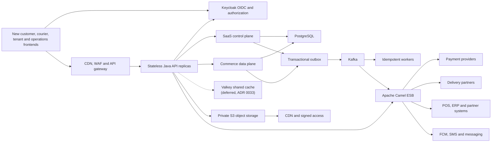

# Qoida Platform

Qoida Platform is the target multi-tenant SaaS commerce and delivery platform
that will incrementally replace the legacy FastAPI system in `../milliy`.

The platform is being redesigned around new tenant-aware frontends, a Java
modular monolith, Keycloak, PostgreSQL, Kafka, Apache Camel, and S3-compatible
object storage. This is not a line-by-line language rewrite: the goal is to
correct the current data model, make tenant onboarding repeatable, isolate
business capabilities, and make payment and delivery providers independently
extensible.

## Project status

This section carries no hand-written counts or gap lists: two previous
revisions of it drifted dozens of migrations behind the code and kept
narrating closed gaps as open. The status sources that are maintained by
tooling or adversarial review, in order of authority:

- [docs/adr/README.md](docs/adr/README.md) — the generated status summary.
  Every record carries a decision status and an implementation status; `Built`
  means an operator could use the whole feature today, and each `Partial`
  status line names what exists and what does not. Records are filed by status
  under [`built/`](docs/adr/built/), [`partial/`](docs/adr/partial/), and
  [`not-started/`](docs/adr/not-started/).
- [docs/minimum-viable-cutover.md](docs/minimum-viable-cutover.md) — the
  smallest slice that takes a real paid order, and the execution order that
  outranks the breadth of the ADR list.
- [The founding review](../docs/qoida-review.md) — the honest state of the
  whole platform, backend and frontends, as of the HorecaOS import
  (2026-08-30), including what remains before a pilot.

The frontends live in [`../frontend`](../frontend) and [`../mobile`](../mobile)
since the monorepo decision
([ADR 0052](docs/adr/partial/0052-one-repository-for-the-whole-platform.md));
their state at import is recorded in the founding review and in
[`../frontend/README.md`](../frontend/README.md).

The detailed migration sequence is in
[docs/migration-plan.md](docs/migration-plan.md). The
[migration coverage register](docs/migration-coverage.md) tracks every known
legacy data family, API surface, frontend, runtime dependency, and unresolved
disposition so active behavior cannot disappear accidentally.

## Technology baseline

| Component | Baseline |
|---|---|
| Language/runtime | Java 25 |
| Application | Spring Boot 4.1.0 |
| Module boundaries | Spring Modulith 2.1.0 |
| Integration runtime | Apache Camel 4.22.0 |
| API documentation | Springdoc OpenAPI 3.0.3 and Swagger UI |
| Build | Maven Wrapper 3.9.16 |
| System of record | PostgreSQL 18 for local development |
| Persistence | Spring JDBC, explicit SQL, and Flyway migrations |
| Durable messaging | Apache Kafka 4.3.1 for local development |
| Identity | Keycloak 26.7.0 for local development |

The version and build decisions are recorded in
[ADR 0001](docs/adr/built/0001-platform-foundation.md).

## Get started

Install JDK 25 and Docker, then run:

```bash
docker compose up -d
./mvnw verify
make run
```

The Maven Wrapper downloads Maven automatically. The API exposes liveness at
`http://localhost:8080/actuator/health/liveness` and readiness at
`http://localhost:8080/actuator/health/readiness`.

Runtime-generated API documentation is available at:

- Swagger UI: `http://localhost:8080/swagger-ui.html`
- OpenAPI JSON: `http://localhost:8080/v3/api-docs`
- OpenAPI YAML: `http://localhost:8080/v3/api-docs.yaml`

Swagger describes protected operations with a Keycloak bearer-JWT security
scheme. Use Swagger UI's **Authorize** action with a development access token;
authorization is not persisted across page reloads.

The first control-plane endpoints are rooted at:

```text
/api/v1/control-plane/tenants
```

`make run` activates the local-only fixture profile. It supplies a published
demo menu, inventory, prices, serviceability and delivery zone; see
[local fixtures](docs/local-fixtures.md) for stable IDs and ready-to-run API
requests.

They support tenant creation and Keycloak-organization reconciliation, plus
brand and location creation/listing. Creating a tenant requires the global
`platform-admin` role. Tenant reads require membership in the matching
Keycloak organization, while tenant writes require `tenant-owner` or
`tenant-admin` inside that exact organization claim.

See [local development](docs/development.md) for services, configuration, and
module conventions.

## Product model

Qoida is moving toward SaaS. The primary ownership hierarchy is:

```text
Tenant
├── Brand A
│   ├── Location A1
│   └── Location A2
└── Brand B
    ├── Location B1
    └── Location B2
```

- **Tenant:** the legal/commercial SaaS customer and isolation, billing,
  subscription, and administration boundary.
- **Brand:** a customer-facing identity operated by a tenant.
- **Location:** a physical or virtual fulfillment point operated by a brand.

The legacy `Company` concept generally maps to a brand, while `Vendor`
generally maps to a location. Multiple legacy companies may need to be grouped
under one new tenant through an explicit business-approved mapping.

## Architecture direction



### SaaS control plane

The control plane owns:

- Tenant onboarding and lifecycle
- Plans, subscriptions, entitlements, and usage metering
- Brands, locations, domains, and themes
- Tenant users, scoped roles, and permissions
- Integration installations and secret references
- Configuration defaults and overrides
- Tenant administration and audit

Onboarding is a resumable workflow:

```text
DRAFT -> PROVISIONING -> CONFIGURING -> VALIDATING
      -> READY -> ACTIVATING -> ACTIVE
```

Onboarding templates provide versioned defaults for roles, languages,
currency, order types, UI content, integrations, and required readiness checks.
Catalog and location imports support dry runs, validation, previews,
idempotency, checkpoints, and reconciliation.

### Commerce data plane

The data plane owns:

- Catalog and location offerings
- Inventory balances, reservations, and movements
- Customers, addresses, devices, and carts
- Pricing, promotions, coupons, and adjustments
- Orders and immutable commercial snapshots
- Payment intents, attempts, refunds, and reconciliation
- Shipments, internal couriers, external delivery partners, and tracking
- Notifications and delivery attempts
- Reporting read models

### Identity and authorization

Keycloak is the identity and access-management platform. It owns credentials,
authentication flows, SSO, MFA, sessions, external identity brokering,
organization membership, and coarse application roles. Java APIs validate
Keycloak access tokens and enforce resource-level tenant, brand, location, and
entitlement rules.

The working B2B model maps one Keycloak Organization to one Qoida tenant so
tenant users can be invited or federated without provisioning a realm per
tenant; [ADR 0003](docs/adr/built/0003-keycloak-tenant-authorization.md) records why
realm-per-tenant was rejected. The boundary between Keycloak roles and
application authorization is decided in
[ADR 0025](docs/adr/built/0025-fine-grained-authorization-and-capability-model.md):
Keycloak owns authentication, organization membership, and coarse roles, while
Qoida owns capability grants scoped to tenant, brand, and location. Customer
phone and OTP login remains an open Keycloak flow decision.

Frontends use Authorization Code with PKCE and separate public clients. APIs,
Camel routes, migration tooling, and machine integrations use separate
resource-server or service-account clients with least-privilege scopes.

### Frontend platform

All active frontends will be replaced incrementally. The target product
surfaces are:

- Platform administration
- Tenant administration and onboarding
- Brand/location operations
- Customer storefront
- Courier workflows

The target stack is decided in
[ADR 0022](docs/adr/not-started/0022-frontend-platform-authentication-and-journey-migration.md):
React with TypeScript as the single component framework, Next.js for the
storefront, and Vite with TanStack Router and Query for the authenticated
applications. The applications share a design system, localization, runtime
tenant/brand theming, Keycloak integration, observability, and generated
OpenAPI clients. Shared packages import React only, never a meta-framework
API.
Each application migrates by vertical feature slice and controlled cohort;
legacy and new frontends may coexist temporarily behind the gateway.

### Apache Camel ESB

Apache Camel is the integration and ESB layer for payment providers, delivery
partners, POS/ERP systems, notifications, files, HTTP APIs, and other external
protocols. It applies Enterprise Integration Patterns for routing,
transformation, throttling, retries, circuit breaking, idempotency, and
dead-letter handling.

Camel does not own orders, payments, shipments, or onboarding state. It
implements integration adapters around domain ports and exchanges durable
asynchronous messages through Kafka. Routes can be packaged and scaled
independently when their operational profiles differ.

## Initial module boundaries

The Java backend begins as a modular monolith with the following capabilities:

```text
iam             Keycloak links, principals and authorization projections
tenancy         tenants, brands, locations, configuration and onboarding
customers       customer accounts, brand profiles, addresses and consent
catalog         catalogs, products, variants and location offerings
inventory       balances, reservations and movements
pricing         prices, promotions, coupons and adjustments
ordering        carts, orders, snapshots and state transitions
payments        intents, attempts, refunds and merchant accounts
fulfillment     shipments, couriers, partners, tracking and zones
media           assets, uploads, derivatives and retention
notifications   preferences, templates and delivery attempts
integration     Camel routes, adapters, inbox/outbox and synchronization
reporting       projections and operational reporting
audit           security and business audit events
```

ADRs 0013 and 0021 add dedicated `recovery` and `commercial` modules for
service-recovery/remedy decisions and SaaS plans/subscriptions/usage. Their
schemas and module declarations are added only when those ADRs enter
implementation; until then these are planned boundaries, not implemented ones.
Cross-cutting capabilities live inside existing modules rather than becoming new
ones: authorization and field-level encryption in `iam`, configuration and
policy resolution in `tenancy`, provider installations in `integration`, and
audit evidence in `audit`.

Customer, vendor, courier, and operations HTTP APIs are adapters. They invoke
shared application use cases rather than owning duplicate business logic.

## Provider extensibility

Payment and delivery integrations use small ports implemented by isolated
adapters. The core model never depends on a Click, Payme, Yandex, or other
provider SDK or Apache Camel route type.

Examples of payment capabilities include:

- Initiate payment
- Query payment status
- Capture or cancel
- Refund
- Verify and normalize a webhook

Examples of delivery capabilities include:

- Quote delivery
- Create or cancel a shipment
- Query status
- Track a shipment
- Verify and normalize a webhook

Provider credentials live in a secrets manager. PostgreSQL stores scoped
installation configuration and a secret reference. Configuration resolves
through:

```text
Platform default -> Tenant default -> Brand override -> Location override
```

## Target data model principles

- Every tenant-owned row contains `tenant_id`.
- Tenant scope is protected with composite constraints and authorization.
- Products are brand-owned, may be offered by that brand's locations, and are
  never shared across brands.
- `LocationOffering` stores same-brand location sellability, schedule,
  fulfillment modes, and preparation overrides. Pricing owns money/tax rules,
  inventory owns quantity/availability facts, and integration owns external
  identifiers/mappings.
- Inventory has one balance, reservations, and a movement ledger.
- Orders store immutable customer, address, item, price, discount, tax, and
  currency snapshots.
- Payment, preparation, and fulfillment lifecycles are modeled separately.
- A payment intent can have multiple payment attempts and refunds.
- An order can have multiple shipments and assignment attempts.
- Money uses integer minor units and an ISO currency code.
- Instants use UTC; locations retain an IANA timezone.
- JSONB is reserved for provider payloads, events, and flexible metadata rather
  than core searchable state.
- Geographic points and zones use PostGIS when fulfillment is implemented.

The initial PostgreSQL schema ownership is:

```text
iam
tenant
customer
catalog
inventory
pricing
ordering
payments
fulfillment
media
notifications
integration
reporting
audit
```

ADRs 0013 and 0021 add `commercial` and `recovery` schemas when their module
boundaries are implemented; they are not present in the foundation migration
yet. The `audit` schema exists but is empty until
[ADR 0027](docs/adr/partial/0027-audit-evidence-and-approval-model.md) is implemented.

## Kafka model

Redis Pub/Sub will be replaced with Kafka and transactional event publication.

Initial topic families are business-oriented rather than provider- or
tenant-oriented:

```text
tenancy.events
orders.events
payments.events
fulfillment.events
notifications.commands
```

Every external event includes:

```text
eventId, eventType, eventVersion, tenantId, aggregateId,
correlationId, occurredAt, trace metadata and payload
```

Topic naming, partitioning, retention, schema governance, and the
compatibility gate are decided in
[ADR 0032](docs/adr/built/0032-event-contract-governance-and-topic-policy.md).
Messages are partitioned by the aggregate whose ordering must be preserved.
Delivery is treated as at-least-once, so consumers and provider webhooks must
be idempotent. Business state and an outbox record are committed in the same
PostgreSQL transaction; an independent relay publishes the event to Kafka. The
relay claims only the oldest unresolved event for a partition key, uses lease
tokens and `FOR UPDATE SKIP LOCKED`, and retains exhausted events as operational
dead letters. Delivery remains at-least-once, so consumers deduplicate by
`eventId`.

## Media and S3

Media is represented by `media_asset` rather than local path strings embedded
in business entities. It records ownership, immutable object key, content type,
size, checksum, visibility, processing status, and optional dimensions.

Object keys follow a tenant-aware immutable structure:

```text
tenants/{tenantId}/products/{productId}/{assetId}/original.jpg
tenants/{tenantId}/products/{productId}/{assetId}/w400.webp
```

Buckets remain private. Public catalog content is served through a CDN with
origin access control, while private content uses short-lived signed access.
New uploads use presigned URLs and are validated before becoming available.

## Migration strategy

The migration follows an expand-and-contract approach:

1. Stabilize and profile the legacy platform.
2. Approve the target domain model and invariants.
3. Build the Java platform foundation and new PostgreSQL schemas.
4. Introduce Keycloak and identity-linking without migrating legacy sessions.
5. Establish the Camel integration runtime and Kafka contracts.
6. Build new frontend shells and migrate journeys incrementally.
7. Introduce S3 and Kafka without a big-bang cutover.
8. Backfill, shadow, and reconcile one bounded capability at a time.
9. Migrate notifications and lower-risk capabilities first.
10. Migrate payments, fulfillment, and ordering only after their state machines,
   idempotency, and reconciliation are proven.
11. Retire legacy APIs and frontends only after an agreed rollback window.

At every point, each domain has exactly one authoritative writer.

## Approved domain defaults

- One principal may belong to multiple tenants.
- Customer identity is configurable per tenant as `TENANT_SHARED` or
  `BRAND_ISOLATED`, with brand profiles in both modes.
- Catalogs and products are brand-owned.
- Each location belongs to exactly one brand.
- An order belongs to one tenant, brand, and fulfillment location.
- Order acceptance resolves through platform, tenant, brand, and location and
  supports auto-confirm or restaurant approval.
- Restaurant approval accepts both Qoida Operations and POS decisions; the
  first valid decision wins.
- Payment, delivery, and integration settings may be overridden at narrower
  scopes where the relevant capability supports it.
- Subscriptions and billing are tenant-owned.
- Multiple payment attempts and shipments remain supported even when the first
  release normally creates one shipment.

## Documentation

- [Architecture decisions, status model, and roadmap](docs/adr/README.md)
- [Minimum viable cutover](docs/minimum-viable-cutover.md) — the smallest slice
  that can take a real order, and what is deliberately deferred
- [Migration plan](docs/migration-plan.md)
- [Migration coverage and readiness register](docs/migration-coverage.md)
- [Domain model, ERD, state machines, and processes](docs/domains/README.md)
- [Local development](docs/development.md)
- [Agent and implementation rules](AGENTS.md)
- [The Qoida SDLC](docs/sdlc.md) — how a change moves from `intent.md` through
  `spec.md`, `plan.md`, review, and release, and where a person decides
- [Review policy](REVIEW.md) — what every pull request is reviewed against

Decisions most often needed when starting work:

| Topic | ADR |
|---|---|
| Platform, language, module boundaries | [0001](docs/adr/built/0001-platform-foundation.md) |
| Tenant, brand, location, order acceptance | [0002](docs/adr/partial/0002-saas-domain-model.md) |
| Tenant authorization and Keycloak | [0003](docs/adr/built/0003-keycloak-tenant-authorization.md) |
| Outbox, Kafka delivery, persistence style | [0004](docs/adr/built/0004-sql-outbox-and-kafka-delivery.md) |
| Capabilities, grants, scopes | [0025](docs/adr/built/0025-fine-grained-authorization-and-capability-model.md) |
| Provider installations and bindings | [0026](docs/adr/built/0026-provider-installations-bindings-and-secret-references.md) |
| Audit facts and maker-checker approvals | [0027](docs/adr/partial/0027-audit-evidence-and-approval-model.md) |
| Secrets and credential rotation | [0028](docs/adr/partial/0028-secrets-management-and-credential-lifecycle.md) |
| PII classification and encryption | [0029](docs/adr/partial/0029-pii-protection-envelope-encryption-and-key-rotation.md) |
| Scoped configuration and policy versions | [0030](docs/adr/partial/0030-configuration-and-policy-resolution.md) |
| HTTP conventions, idempotency, errors | [0031](docs/adr/built/0031-http-api-conventions.md) |
| Event schemas, topics, compatibility | [0032](docs/adr/built/0032-event-contract-governance-and-topic-policy.md) |
| Caching and rate limiting | [0033](docs/adr/partial/0033-caching-rate-limiting-and-shared-runtime-state.md) |
| Hosting, environments, data residency | [0034](docs/adr/partial/0034-hosting-environments-topology-and-data-residency.md) |
