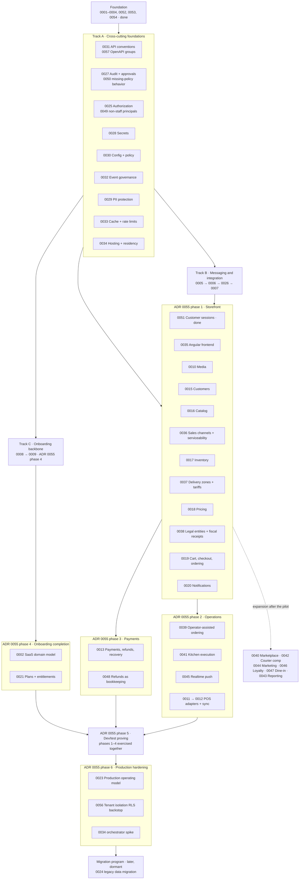

# Architecture decisions

This directory holds every architecture decision record for HorecaOS Platform,
including the records written in its Qoida era, which keep their historical names.

Start with [ADR 0000](meta/0000-adr-process-and-status-model.md), which defines how
these records are written, and [`TEMPLATE.md`](TEMPLATE.md) for new ones.

## Status model

Every ADR carries two independent statuses, because "the decision is settled"
and "the code exists" are different facts.

| Decision status | Meaning |
|---|---|
| `Proposed` | The structure could still change because an `Open inputs` item is unresolved |
| `Accepted` | The decision is settled. Build it without reopening the argument |
| `Rejected` | Considered and deliberately not selected |
| `Superseded` | A later ADR replaces it; see `Superseded by` |

| Implementation status | Meaning |
|---|---|
| `Not started` | No code |
| `Partial` | Some of it exists; the status line says what does not |
| `Built` | A real operator could use the whole feature today |
| `Not applicable` | Process or governance record with no code |

`Partial` and `Built` replaced `In progress` and `Done` during the reconciliation
of 2026-08-24. `In progress` claimed something the records could not support —
it reads as "somebody is working on this", and for most of them nobody was. That
is how twenty-three records came to sit on a bare `In progress` while the code
moved underneath them. `Built` is deliberately harder to earn than `Done`: a
module that exists but that nothing calls is `Partial`, and its status line has
to say so.

The status line is machine-read. It begins with one of the four tokens above,
then an em dash, then what exists and what does not:

```text
- Implementation status: Partial — V0027 and the payments module build the
  intent and attempt lifecycle; not built: refunds have no table, state, or
  endpoint.
```

[ADR 0000](meta/0000-adr-process-and-status-model.md) now documents this same
vocabulary; it was corrected in the 2026-08-30 documentation-accuracy pass, with
the owner's sign-off, as a process-description fix rather than a decision change.

`Accepted` plus `Not started` is normal and common. `Proposed` means an
external answer is genuinely missing, and every such ADR lists who owns it.

Every ADR also carries `## Alternatives considered` with the options that lost
and the trigger that would make each win again, and `## Consequences` including
negative consequences. If a decision feels wrong later, read the alternatives
table before proposing a change; the answer is often already there.

## By implementation status

<!-- generated:status-summary -->

| Status | Records | Where |
|---|---|---|
| **Built** — A real operator could use the whole feature today. | 17 | [`built/`](built/) |
| **Partial** — Some of it exists. Each record's status line names what does not. | 49 | [`partial/`](partial/) |
| **Not started** — Decided and not begun. | 4 | [`not-started/`](not-started/) |
| **Not applicable** — Process records that govern documents rather than code. | 2 | [`meta/`](meta/) |

**Built** — [0001](built/0001-platform-foundation.md), [0003](built/0003-keycloak-tenant-authorization.md), [0004](built/0004-sql-outbox-and-kafka-delivery.md), [0005](built/0005-kafka-inbox-and-idempotent-consumers.md), [0025](built/0025-fine-grained-authorization-and-capability-model.md), [0026](built/0026-provider-installations-bindings-and-secret-references.md), [0031](built/0031-http-api-conventions.md), [0032](built/0032-event-contract-governance-and-topic-policy.md), [0049](built/0049-non-staff-principal-authorization.md), [0050](built/0050-missing-approval-policy-behavior.md), [0051](built/0051-customer-session-authentication.md), [0053](built/0053-horecaos-identity-and-rebrand.md), [0054](built/0054-build-time-quality-gates.md), [0057](built/0057-openapi-per-surface-document-groups.md), [0062](built/0062-staff-sign-in-happens-inside-the-platform.md), [0066](built/0066-platform-admin-joins-the-control-plane-openapi-surface.md), [0068](built/0068-tenant-terms-of-service-documents.md)

**Partial** — [0002](partial/0002-saas-domain-model.md), [0006](partial/0006-message-retry-dead-letter-and-replay-operations.md), [0007](partial/0007-camel-route-foundation-and-provider-contract-testing.md), [0008](partial/0008-resumable-tenant-onboarding-workflow.md), [0009](partial/0009-keycloak-organization-provisioning-and-membership-reconciliation.md), [0010](partial/0010-s3-media-lifecycle-and-filesystem-migration.md), [0011](partial/0011-pos-installations-bindings-and-capability-adapters.md), [0012](partial/0012-pos-catalog-sync-staging-and-reconciliation.md), [0013](partial/0013-payment-refund-and-service-recovery-compensation.md), [0014](partial/0014-scheduled-delivery-sourcing-and-partner-orchestration.md), [0015](partial/0015-customer-accounts-cross-brand-identity-and-consent.md), [0016](partial/0016-brand-catalog-publication-and-location-offerings.md), [0017](partial/0017-inventory-ledger-reservations-and-availability.md), [0018](partial/0018-deterministic-pricing-promotions-taxes-and-quotes.md), [0019](partial/0019-cart-checkout-and-order-orchestration.md), [0020](partial/0020-notification-preferences-templates-and-delivery.md), [0021](partial/0021-saas-plans-entitlements-and-usage-metering.md), [0023](partial/0023-production-operating-model-observability-security-and-recovery.md), [0024](partial/0024-legacy-data-migration-cutover-and-retirement.md), [0027](partial/0027-audit-evidence-and-approval-model.md), [0028](partial/0028-secrets-management-and-credential-lifecycle.md), [0029](partial/0029-pii-protection-envelope-encryption-and-key-rotation.md), [0030](partial/0030-configuration-and-policy-resolution.md), [0033](partial/0033-caching-rate-limiting-and-shared-runtime-state.md), [0034](partial/0034-hosting-environments-topology-and-data-residency.md), [0035](partial/0035-angular-frontend-platform-and-design-system-adoption.md), [0036](partial/0036-sales-channels-and-location-serviceability.md), [0037](partial/0037-delivery-zones-tariffs-and-fee-resolution.md), [0038](partial/0038-legal-entities-fiscal-receipts-and-product-classification.md), [0039](partial/0039-operator-assisted-ordering-and-order-amendment.md), [0040](partial/0040-marketplace-channel-and-partner-api.md), [0041](partial/0041-kitchen-execution-and-production-routing.md), [0042](partial/0042-courier-compensation-shifts-and-settlement.md), [0043](partial/0043-reporting-analytics-and-the-metric-layer.md), [0044](partial/0044-marketing-campaigns-audiences-and-engagement.md), [0045](partial/0045-realtime-operational-push-and-field-telemetry.md), [0046](partial/0046-loyalty-points-and-split-tender.md), [0047](partial/0047-dine-in-table-service-and-qr-ordering.md), [0048](partial/0048-refunds-as-bookkeeping-and-the-order-remedy-model.md), [0052](partial/0052-one-repository-for-the-whole-platform.md), [0058](partial/0058-telegram-notification-channels.md), [0059](partial/0059-conversational-engagement-and-the-sendpulse-exit.md), [0060](partial/0060-tenant-staff-flutter-app-and-interactive-telegram-bot.md), [0061](partial/0061-production-deployment-pilot-on-owned-hardware-portable-by-construction.md), [0063](partial/0063-telegram-native-customer-identity.md), [0064](partial/0064-voice-channels-and-the-operator-presence-model.md), [0065](partial/0065-tenant-self-service-integrations-and-the-write-only-secret-door.md), [0067](partial/0067-referral-program-rewards-through-the-loyalty-ledger.md), [0071](partial/0071-order-reviews-a-rating-the-tenant-can-see.md)

**Not started** — [0022](not-started/0022-frontend-platform-authentication-and-journey-migration.md), [0056](not-started/0056-tenant-isolation-enforcement-and-rls.md), [0069](not-started/0069-an-assistant-answers-customers-from-platform-facts.md), [0070](not-started/0070-a-storefront-is-a-client-of-a-published-contract.md)

**Not applicable** — [0000](meta/0000-adr-process-and-status-model.md), [0055](meta/0055-greenfield-launch-scope.md)

<!-- /generated:status-summary -->

## Index

### Foundation

| ADR | Decision | Decision status | Implementation |
|---|---|---|---|
| [0000](meta/0000-adr-process-and-status-model.md) | ADR process, status model, and numbering | Accepted | Not applicable |
| [0001](built/0001-platform-foundation.md) | Java 25 modular-monolith foundation | Accepted | Built |
| [0002](partial/0002-saas-domain-model.md) | SaaS domain model and order acceptance | Accepted | Partial |
| [0003](built/0003-keycloak-tenant-authorization.md) | Keycloak tenant authorization | Accepted | Built |
| [0004](built/0004-sql-outbox-and-kafka-delivery.md) | SQL transactional outbox and Kafka delivery | Accepted | Built |
### Cross-cutting foundations

These are consumed by nearly every capability ADR. They were originally implied
rather than decided, which is why several later ADRs referenced contracts that
did not exist.

| ADR | Decision | Decision status | Implementation |
|---|---|---|---|
| [0025](built/0025-fine-grained-authorization-and-capability-model.md) | Fine-grained authorization and the capability model | Accepted | Built |
| [0026](built/0026-provider-installations-bindings-and-secret-references.md) | Provider installations, bindings, and secret references | Accepted | Built |
| [0027](partial/0027-audit-evidence-and-approval-model.md) | Audit evidence and the approval model | Accepted | Partial |
| [0028](partial/0028-secrets-management-and-credential-lifecycle.md) | Secrets management and credential lifecycle | Accepted | Partial |
| [0029](partial/0029-pii-protection-envelope-encryption-and-key-rotation.md) | PII protection, envelope encryption, and key rotation | Accepted | Partial |
| [0030](partial/0030-configuration-and-policy-resolution.md) | Configuration and policy resolution | Accepted | Partial |
| [0031](built/0031-http-api-conventions.md) | HTTP API conventions | Accepted | Built |
| [0032](built/0032-event-contract-governance-and-topic-policy.md) | Event contract governance and topic policy | Accepted | Built |
| [0033](partial/0033-caching-rate-limiting-and-shared-runtime-state.md) | Caching, rate limiting, and shared runtime state | Accepted | Partial |
| [0034](partial/0034-hosting-environments-topology-and-data-residency.md) | Hosting environments, topology, and data residency | Accepted | Partial |
| [0035](partial/0035-angular-frontend-platform-and-design-system-adoption.md) | Angular frontend platform and design system adoption | Accepted | Partial |
| [0036](partial/0036-sales-channels-and-location-serviceability.md) | Sales channels and location serviceability | Accepted | Partial |
| [0037](partial/0037-delivery-zones-tariffs-and-fee-resolution.md) | Delivery zones, tariffs, and delivery-fee resolution | Accepted | Partial |
| [0038](partial/0038-legal-entities-fiscal-receipts-and-product-classification.md) | Legal entities, fiscal receipts, and fiscal product classification | Accepted | Partial |
| [0039](partial/0039-operator-assisted-ordering-and-order-amendment.md) | Operator-assisted ordering, order amendment, and terminal outcome accounting | Accepted | Partial |
| [0040](partial/0040-marketplace-channel-and-partner-api.md) | Marketplace channel: inbound aggregator orders and the partner API | Accepted | Partial |
| [0041](partial/0041-kitchen-execution-and-production-routing.md) | Kitchen execution, production routing, and kitchen release | Accepted | Partial |
| [0042](partial/0042-courier-compensation-shifts-and-settlement.md) | Courier compensation, shifts, and settlement | Accepted | Partial |
| [0043](partial/0043-reporting-analytics-and-the-metric-layer.md) | Reporting, analytics, and the metric layer | Accepted | Partial |
| [0044](partial/0044-marketing-campaigns-audiences-and-engagement.md) | Marketing campaigns, audiences, and engagement content | Accepted | Partial |
| [0045](partial/0045-realtime-operational-push-and-field-telemetry.md) | Real-time operational push and field telemetry | Accepted | Partial |
| [0046](partial/0046-loyalty-points-and-split-tender.md) | Loyalty points and split tender | Accepted | Partial |
| [0047](partial/0047-dine-in-table-service-and-qr-ordering.md) | Dine-in: table service, reservations, and QR ordering | Accepted | Partial |
| [0049](built/0049-non-staff-principal-authorization.md) | Non-staff principals use typed relationship authorization | Accepted | Built |
| [0050](built/0050-missing-approval-policy-behavior.md) | Missing approval policy behavior is explicit per action | Accepted | Built |
### Capabilities

| ADR | Decision | Decision status | Implementation |
|---|---|---|---|
| [0005](built/0005-kafka-inbox-and-idempotent-consumers.md) | Kafka inbox and idempotent consumers | Accepted | Built |
| [0006](partial/0006-message-retry-dead-letter-and-replay-operations.md) | Retry, dead-letter, and replay operations | Accepted | Partial |
| [0007](partial/0007-camel-route-foundation-and-provider-contract-testing.md) | Camel route foundation and provider contract testing | Accepted | Partial |
| [0008](partial/0008-resumable-tenant-onboarding-workflow.md) | Resumable tenant onboarding workflow | Accepted | Partial |
| [0009](partial/0009-keycloak-organization-provisioning-and-membership-reconciliation.md) | Keycloak organization provisioning and reconciliation | Accepted | Partial |
| [0010](partial/0010-s3-media-lifecycle-and-filesystem-migration.md) | S3 media lifecycle and filesystem migration | Accepted | Partial |
| [0011](partial/0011-pos-installations-bindings-and-capability-adapters.md) | POS capability adapters | Accepted | Partial |
| [0012](partial/0012-pos-catalog-sync-staging-and-reconciliation.md) | POS catalog sync, staging, and reconciliation | Accepted | Partial |
| [0013](partial/0013-payment-refund-and-service-recovery-compensation.md) | Payments, refunds, and service recovery | Accepted | Partial |
| [0048](partial/0048-refunds-as-bookkeeping-and-the-order-remedy-model.md) | Refunds as bookkeeping, and the order-remedy model | Accepted | Partial |
| [0014](partial/0014-scheduled-delivery-sourcing-and-partner-orchestration.md) | Scheduled delivery sourcing and partner orchestration | Accepted | Partial |
| [0015](partial/0015-customer-accounts-cross-brand-identity-and-consent.md) | Customer accounts, cross-brand identity, and consent | Accepted | Partial |
| [0016](partial/0016-brand-catalog-publication-and-location-offerings.md) | Brand catalog, publication, and location offerings | Accepted | Partial |
| [0017](partial/0017-inventory-ledger-reservations-and-availability.md) | Inventory ledger, reservations, and availability | Accepted | Partial |
| [0018](partial/0018-deterministic-pricing-promotions-taxes-and-quotes.md) | Deterministic pricing, promotions, taxes, and quotes | Accepted | Partial |
| [0019](partial/0019-cart-checkout-and-order-orchestration.md) | Cart, checkout, and order orchestration | Accepted | Partial |
| [0020](partial/0020-notification-preferences-templates-and-delivery.md) | Notification preferences, templates, and delivery | Accepted | Partial |
| [0021](partial/0021-saas-plans-entitlements-and-usage-metering.md) | SaaS plans, entitlements, and usage metering | Accepted | Partial |
| [0022](not-started/0022-frontend-platform-authentication-and-journey-migration.md) | Frontend platform, authentication, and journey migration | Superseded | Not started |
| [0023](partial/0023-production-operating-model-observability-security-and-recovery.md) | Production operating model and recovery | Accepted | Partial |
| [0024](partial/0024-legacy-data-migration-cutover-and-retirement.md) | Legacy data migration, cutover, and retirement | Accepted | Partial |
## Implementation roadmap

**This section is the only authoritative statement of execution order.** ADR
numbers are immutable identifiers assigned in creation order, not sequence
numbers. An ADR does not state its own position in the plan.

**[ADR 0055](meta/0055-greenfield-launch-scope.md) (2026-08-30) replaced the
migration-shaped order this section used to describe with launch phases.** The
platform's first production launch is greenfield — new tenants only, no legacy
data or traffic in scope — and the legacy migration program (production
discovery, credential rotation, backfill, shadow, cutover, retirement) becomes a
later, separate program that starts only once production exists. The tracks and
phases below are organized around that: cross-cutting foundations and the
messaging/onboarding backbone still run before or alongside the first capability
that needs them; everything else is grouped into ADR 0055's six launch phases
(storefront → operations → payments → onboarding completion → dev/test proving →
production hardening), with the migration program placed after them, dormant
until it starts. Records 0036–0057, added since this roadmap was last written,
are placed in the phase or track their subject matter belongs to.

The plan is a dependency graph, not a line. Work in different tracks or within
one phase can proceed in parallel wherever the graph allows it, and pretending
otherwise understates capacity and overstates coupling.



### Track A — cross-cutting foundations

Build before or alongside the first capability that needs them. Several are
small. All of them were previously assumed by later ADRs without existing.

| Order | ADR | Why here |
|---:|---|---|
| A1 | [0031](built/0031-http-api-conventions.md) | Sixteen-plus ADRs specify endpoints assuming these conventions. Built |
| A2 | [0027](partial/0027-audit-evidence-and-approval-model.md), [0050](built/0050-missing-approval-policy-behavior.md) | ADR 0006 needs audited replay at the very start of Track B. 0050 settles 0027's missing-policy open input |
| A3 | [0025](built/0025-fine-grained-authorization-and-capability-model.md), [0049](built/0049-non-staff-principal-authorization.md) | Narrows ADR 0003's read rule. Cheapest to do before more tenant data is exposed. 0049 extends it to partner and courier principals |
| A4 | [0028](partial/0028-secrets-management-and-credential-lifecycle.md) | ADR 0007 needs a secrets manager to exist |
| A5 | [0030](partial/0030-configuration-and-policy-resolution.md) | Eight-plus ADRs re-describe scoped resolution; one mechanism instead |
| A6 | [0032](built/0032-event-contract-governance-and-topic-policy.md) | Cheap now on eighteen events; expensive after a hundred |
| A7 | [0029](partial/0029-pii-protection-envelope-encryption-and-key-rotation.md) | Needed by ADR 0010 media classification, well before ADR 0015 |
| A8 | [0033](partial/0033-caching-rate-limiting-and-shared-runtime-state.md) | Consumed by 0025, 0030, 0021; also corrects the architecture diagram |
| A9 | [0034](partial/0034-hosting-environments-topology-and-data-residency.md) | Accepted: colocation in Uzbekistan first, AWS later. Only the orchestrator spike remains, and that spike is now ADR 0055 phase 6 |
| A10 | [0057](built/0057-openapi-per-surface-document-groups.md) | Splits 0031's OpenAPI document per surface so a frontend pins only its own baseline and client. Built |

### Track B — messaging and integration backbone

`0005` → `0006` → `0026` → `0007`. Strictly sequential. `0007`'s fake-provider
contract suite is also the direct prerequisite for ADR 0055 phase 3 (payments):
"payments wired through the fake-provider suite first" is that phase's own
wording.

### Track C — onboarding backbone

`0008` → `0009`. Depends on Track B through 0006 and on A2, A3, A4, A5. Maps to
[ADR 0055](meta/0055-greenfield-launch-scope.md) phase 4, "tenant onboarding
workflow completed so a pilot tenant is created through the API" — see that
phase below for the rest of what phase 4 needs.

## Launch phases (ADR 0055)

Everything below is a launch-phase track, in ADR 0055's execution order. A
phase's ADRs can proceed in parallel with each other and, where the graph
allows it, with an earlier phase's tail — the phases mark a dependency and
proving order, not a strict release-train sequence.

### Phase 1 — storefront

Sequential through catalog and pricing, with real parallelism: `0010` media,
`0015` customers, and `0036` sales channels do not depend on each other.

| Order | ADR | Why here |
|---:|---|---|
| 1 | [0051](built/0051-customer-session-authentication.md) | Customer sign-in. Built — the storefront has nothing to authenticate a cart against without it |
| 2 | [0035](partial/0035-angular-frontend-platform-and-design-system-adoption.md) | Platform foundation — workspace, design system, Keycloak PKCE, generated clients — depends only on 0003, 0025, 0031. Start early |
| 3 | [0010](partial/0010-s3-media-lifecycle-and-filesystem-migration.md) | Catalog images. Independent of customers/channels, can run in parallel |
| 4 | [0015](partial/0015-customer-accounts-cross-brand-identity-and-consent.md) | Customer identity the storefront session (0051) resolves into |
| 5 | [0016](partial/0016-brand-catalog-publication-and-location-offerings.md) | Published catalog checkout reads from |
| 6 | [0036](partial/0036-sales-channels-and-location-serviceability.md) | Which channel and location can serve a given order; gates what 0016's offerings are even eligible |
| 7 | [0017](partial/0017-inventory-ledger-reservations-and-availability.md) | Availability checkout reserves against |
| 8 | [0037](partial/0037-delivery-zones-tariffs-and-fee-resolution.md) | Delivery-fee resolution checkout needs whenever fulfillment is delivery, not pickup |
| 9 | [0018](partial/0018-deterministic-pricing-promotions-taxes-and-quotes.md) | Quote contract checkout prices against |
| 10 | [0038](partial/0038-legal-entities-fiscal-receipts-and-product-classification.md) | Which legal entity fiscalizes and how a line item classifies for it; needed before checkout can accept payment |
| 11 | [0019](partial/0019-cart-checkout-and-order-orchestration.md) | Cart, checkout, and order orchestration itself; depends on identity, catalog, inventory, pricing, and fiscal classification above |
| 12 | [0020](partial/0020-notification-preferences-templates-and-delivery.md) | Order confirmation and rejection, the slice's one notification channel |

Not blocking this phase, per `docs/minimum-viable-cutover.md`: 0011/0012 POS
(catalog is authored by hand for the first slice), 0014 external delivery
partners, promotions/coupons in 0018, quantity inventory in 0017. 0047 (dine-in
and QR ordering) and 0046 (loyalty and split tender) are additional storefront
channels and payment options layered on this phase later — see "Not yet placed"
below.

### Phase 2 — operations

The order board a restaurant runs on (`RESTAURANT_APPROVAL`), per ADR 0055's
own description of this phase.

| ADR | Why here |
|---|---|
| [0039](partial/0039-operator-assisted-ordering-and-order-amendment.md) | Staff creating and amending orders on the board itself |
| [0041](partial/0041-kitchen-execution-and-production-routing.md) | What the board routes an approved order to |
| [0045](partial/0045-realtime-operational-push-and-field-telemetry.md) | Live board updates; a polled board is a materially worse product for the same launch |
| [0011](partial/0011-pos-installations-bindings-and-capability-adapters.md) → [0012](partial/0012-pos-catalog-sync-staging-and-reconciliation.md) | Deferred by `docs/minimum-viable-cutover.md` for the pilot slice, but this is still where POS lands once picked up. `0012` follows `0016`, not the reverse — its normalization and difference engine are shaped by the target catalog model, and building it first guaranteed rework |

### Phase 3 — payments

"Payments wired through the fake-provider suite first, per the roadmap rule; a
real provider sandbox when credentials exist" — ADR 0055's own words. Depends on
Track B's `0007` and Track A's `0028`.

| ADR | Why here |
|---|---|
| [0013](partial/0013-payment-refund-and-service-recovery-compensation.md) | Intent, attempt, transaction, webhook verification. The core of this phase |
| [0048](partial/0048-refunds-as-bookkeeping-and-the-order-remedy-model.md) | The approval model and refund reservation that let 0013's refund half move past "handled manually in the provider console" |

0038 (legal entities and fiscal receipts, phase 1) is this phase's fiscalization
counterpart: Click and Payme fiscalize as part of accepting payment, so
fiscalization is proven here even though the ADR sits in phase 1.

### Phase 4 — onboarding completion

Track C (`0008` → `0009`) is this phase's backbone; these two join it to finish
what "tenant onboarding workflow completed so a pilot tenant is created through
the API" requires.

| ADR | Why here |
|---|---|
| [0002](partial/0002-saas-domain-model.md) | Tenant/brand/location model onboarding provisions against |
| [0021](partial/0021-saas-plans-entitlements-and-usage-metering.md) | Not blocking for one pilot tenant (`docs/minimum-viable-cutover.md` allows `METER_ONLY`), but is what onboarding a *second* tenant needs |

### Phase 5 — dev/test proving

Not a set of ADRs — a milestone. ADR 0055: "dev/test environment exercising 1–4
together." This is where phases 1–4 are run end to end against each other
before any production deployment planning starts, using Track B's fake-provider
suite (`0007`) rather than live provider credentials.

### Phase 6 — production hardening

ADR 0055: "production deployment planning (hosting, domain, TLS, secrets,
observability — ADR 0023's open items) as its own subsequent effort."

| ADR | Why here |
|---|---|
| [0023](partial/0023-production-operating-model-observability-security-and-recovery.md) | Production operating model itself — no longer carries secrets, audit, caching, or hosting; those moved into Track A because they were needed earlier |
| [0056](not-started/0056-tenant-isolation-enforcement-and-rls.md) | RLS backstop, explicitly scheduled to "ADR 0055's production-deployment phase," not to dev/test. The application-enforced mechanism it backstops is already built |
| [0034](partial/0034-hosting-environments-topology-and-data-residency.md) orchestrator spike | The one remaining piece of Track A's 0034, per that row above |

### Non-blocking quality work, alongside

ADR 0055 names this explicitly: "client generation, static-analysis promotion,
decomposition, OIDC convergence proceed alongside without displacing 1–5."
[0054](built/0054-build-time-quality-gates.md) (static-analysis gates) and
[0057](built/0057-openapi-per-surface-document-groups.md) (per-surface client
generation) are already built; decomposition and OIDC convergence have no
dedicated ADR yet.

### Later — the migration program (deferred, dormant)

[0024](partial/0024-legacy-data-migration-cutover-and-retirement.md) and the
`migration` module remain in the tree, dormant. Per ADR 0055, the legacy
register's `DECIDE` items and the milliy-facing phases — production discovery,
credential rotation, backfill, shadow, cutover, retirement — move here and no
longer gate the first (greenfield) launch. This program starts only after
production exists, and this roadmap will be extended with its own track
structure when it does.

### Not yet placed — expansion after the pilot

Accepted and buildable when the trigger in `docs/minimum-viable-cutover.md`'s
"After the slice" section arrives; none block the first slice:

| ADR | Subject |
|---|---|
| [0040](partial/0040-marketplace-channel-and-partner-api.md) | Marketplace channel and inbound aggregator orders |
| [0042](partial/0042-courier-compensation-shifts-and-settlement.md) | Own-courier compensation, shifts, and settlement |
| [0043](partial/0043-reporting-analytics-and-the-metric-layer.md) | Reporting, analytics, and the metric layer |
| [0044](partial/0044-marketing-campaigns-audiences-and-engagement.md) | Marketing campaigns, audiences, and engagement content |
| [0046](partial/0046-loyalty-points-and-split-tender.md) | Loyalty points and split tender |
| [0047](partial/0047-dine-in-table-service-and-qr-ordering.md) | Dine-in table service, reservations, and QR ordering |
| [0058](partial/0058-telegram-notification-channels.md) | Telegram notification channels for all three surfaces — operations groups can start alongside the pilot; digests wait on 0043's day-close caller |
| [0059](partial/0059-conversational-engagement-and-the-sendpulse-exit.md) | Conversational engagement — declarative bot flows, contacts as `customers`, the operator inbox, and the SendPulse exit; builds on 0058's plumbing |
| [0060](partial/0060-tenant-staff-flutter-app-and-interactive-telegram-bot.md) | The staff Flutter app and interactive Telegram bot — the acceptance loop runs from a pocket for no-POS tenants; bot is the zero-install floor |

## Relationship to the migration plan

**Since ADR 0055, this table describes the later migration program, not the
first launch.** [`docs/migration-plan.md`](../migration-plan.md) describes
migration **workstreams and their content** for migrating existing legacy
restaurants — work that starts only after production exists for greenfield
tenants, per ADR 0055. For the launch itself, the "Launch phases (ADR 0055)"
section above is authoritative. Where the migration plan and this roadmap
appear to disagree about sequence, this roadmap wins; where they disagree about
migration mechanics, the migration plan wins.

| Migration plan phase | Corresponding ADRs |
|---|---|
| Phase 0 Governance and production discovery | 0034, `docs/migration-coverage.md` |
| Phase 1 Legacy safety baseline | — (legacy-side work) |
| Phase 2 Canonical domain and data model | 0002, `docs/domains` |
| Phase 3 Java, Keycloak, and Camel foundation | 0001, 0003, 0004, 0005, 0006, 0007, 0026 |
| Phase 4 SaaS control plane and onboarding | 0008, 0009, 0021, 0025, 0027, 0030 |
| Phase 5 Frontend platform and application migration | 0035 |
| Phase 6 S3 media migration | 0010, 0029 |
| Phase 7 Kafka migration | 0004, 0005, 0006, 0032 |
| Phase 8 Capability migration sequence | 0011–0020, 0036–0048 |
| Phase 9 Database backfill and synchronization | 0024 |
| Phase 10 Cutover procedure | 0024 |
| Phase 11 Legacy contraction and retirement | 0024 |

The migration plan places frontend work at Phase 5 while this roadmap splits it
into the Track A/C backbone and Phase 1 (storefront). That is the split
described there, not a contradiction.

## Scope and staging

See [`docs/minimum-viable-cutover.md`](../minimum-viable-cutover.md) for the
smallest slice that can take a real order, and for which ADR requirements are
launch-blocking versus later. The full ADR set — see the record counts in
[By implementation status](#by-implementation-status) above — is the shape of
the destination, not the size of the first release, which per
[ADR 0055](meta/0055-greenfield-launch-scope.md) is a greenfield launch, not a
legacy cutover.

## Execution protocol

For every ADR:

1. Read `AGENTS.md`, the ADR, its dependencies, and the referenced domain
   documents completely. Reconcile affected sources in
   `docs/migration-coverage.md` and `docs/domains/legacy-mapping.md`.
2. Close every `Open inputs` item, or record explicitly why the work can proceed
   without it. For external providers, verify current official API and sandbox
   contracts rather than relying on assumptions in the ADR.
3. Leave `Implementation status: Not started` until the first slice of code
   exists, then set `Partial` and keep the status line's factual clause current
   as work proceeds; record any changed assumptions before creating schema or
   code.
4. Update the canonical domain model, ERD, process, state-machine, event
   catalogue, and legacy mapping documents when the capability introduces new
   business facts.
5. Add an expand-only Flyway migration with tenant and composite constraints and
   negative cross-tenant tests.
6. Implement one vertical slice through domain and application port, SQL
   adapter, API, event, or route adapter, authorization, audit, and
   observability.
7. Test domain transitions, PostgreSQL constraints and transactions, duplicate
   and failure semantics, external contracts, and runtime startup.
8. Update migration status, runbooks, configuration documentation, and the ADR
   checklist.
9. Run the complete Java 25 verification against real disposable dependencies.
10. Set `Implementation status: Built` only when the exit criteria are genuinely
    satisfied. If a decision changed along the way, write a new ADR rather than
    editing an accepted one.

## Cross-cutting definition of done

Every capability must address:

- Tenant, brand, and location authorization (ADR 0025) and database isolation
- Idempotency, retries, uncertainty, reconciliation, and concurrency
- Backward-compatible Flyway rollout and rollback behavior
- Versioned API (ADR 0031), event (ADR 0032), and provider contracts
- Secrets (ADR 0028), PII (ADR 0029), audit (ADR 0027), retention, least privilege
- Structured logs, bounded-cardinality metrics, traces, health, and alerts
- Unit, module, PostgreSQL, Kafka, Camel, provider, and negative isolation tests
- Operations visibility and a safe manual fallback
- Migration ownership: exactly one authoritative writer per capability
- Complete source disposition: no affected legacy table, value, route, journey,
  job, webhook, provider effect, report, or manual workflow remains unknown or
  silently dropped

## Important ordering rules

Ten rules held under the migration-shaped plan. Eight are unchanged; two named a
legacy-cutover gate that ADR 0055 removed from the launch path. Both are amended
below rather than dropped, because the underlying caution (don't automate money
movement without reconciliation; don't declare readiness without rehearsed
recovery) still holds — only the legacy-specific half of each moved to the
migration program.

- Do not enable a real Kafka business consumer before ADRs 0005 and 0006.
- Do not enable a real provider route before ADR 0007's fake-provider contract
  suite proves idempotency and uncertain-outcome behavior, and before ADR 0028
  can supply credentials.
- Do not activate automated tenant onboarding before ADR 0009 can reconcile
  Keycloak safely.
- Do not apply POS changes directly to live catalog data. ADR 0012 staging and
  review are mandatory, and ADR 0012 now follows ADR 0016.
- **Amended.** Do not automate refunds or courier bookings before reconciliation
  and single-winner protections in ADRs 0013/0048 and 0014/0042. Fiscal evidence
  needs an approved target under ADR 0038 before it is automated; internal
  courier workflows need ADR 0042's compensation and settlement model. (The
  legacy-side half of this rule — a retirement disposition for legacy fiscal or
  courier data — moved to the migration program; it does not gate the
  greenfield launch.)
- Do not implement checkout around mutable product or price rows. ADRs
  0015–0018 must provide identity, published catalog, reservation, and quote
  contracts. This is Phase 1's own ordering, restated here because it predates
  the phase structure.
- Do not store personal data before ADR 0029, or a credential anywhere except
  ADR 0028's manager.
- Do not publish a new event type without its ADR 0032 schema and catalogue entry.
- **Amended.** Do not start a frontend big-bang rewrite. ADR 0035 migrates one
  coherent Angular platform behind the ADR 0025 authorization and ADR 0031 API
  contracts; ADR 0022, which this rule used to cite, is superseded by ADR 0035.
  Final legacy route cutover is ADR 0024's, and belongs to the migration
  program, not to getting the storefront and operations apps live.
- **Amended.** Do not declare the first (greenfield) production launch ready
  until ADR 0023's recovery exercises and ADR 0056's RLS backstop have produced
  recorded evidence. ADR 0024's cutover rehearsals are a separate gate the
  migration program owns, required before migrating a legacy restaurant, not
  before the first greenfield launch.
