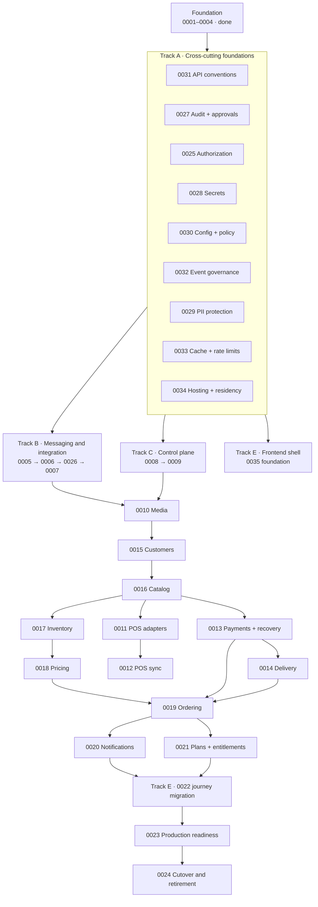

# Architecture decisions

This directory holds every architecture decision record for Qoida Platform.

Start with [ADR 0000](meta/0000-adr-process-and-status-model.md), which defines how
these records are written, and [`TEMPLATE.md`](TEMPLATE.md) for new ones.

## Status model

Every ADR carries two independent statuses, because "the decision is settled"
and "the code exists" are different facts.

| Decision status | Meaning |
|---|---|
| `Proposed` | The structure could still change because an `Open inputs` item is unresolved |
| `Accepted` | The decision is settled. Build it without reopening the argument |
| `Rejected` | Considered and deliberately not selected |
| `Superseded` | A later ADR replaces it; see `Superseded by` |

| Implementation status | Meaning |
|---|---|
| `Not started` | No code |
| `Partial` | Some of it exists; the status line says what does not |
| `Built` | A real operator could use the whole feature today |
| `Not applicable` | Process or governance record with no code |

`Partial` and `Built` replaced `In progress` and `Done` during the reconciliation
of 2026-08-24. `In progress` claimed something the records could not support —
it reads as "somebody is working on this", and for most of them nobody was. That
is how twenty-three records came to sit on a bare `In progress` while the code
moved underneath them. `Built` is deliberately harder to earn than `Done`: a
module that exists but that nothing calls is `Partial`, and its status line has
to say so.

The status line is machine-read. It begins with one of the four tokens above,
then an em dash, then what exists and what does not:

```text
- Implementation status: Partial — V0027 and the payments module build the
  intent and attempt lifecycle; not built: refunds have no table, state, or
  endpoint.
```

[ADR 0000](meta/0000-adr-process-and-status-model.md) still documents the older
vocabulary. Amending it is a decision record change and belongs to the owner.

`Accepted` plus `Not started` is normal and common. `Proposed` means an
external answer is genuinely missing, and every such ADR lists who owns it.

Every ADR also carries `## Alternatives considered` with the options that lost
and the trigger that would make each win again, and `## Consequences` including
negative consequences. If a decision feels wrong later, read the alternatives
table before proposing a change; the answer is often already there.

## By implementation status

<!-- generated:status-summary -->

| Status | Records | Where |
|---|---|---|
| **Built** — A real operator could use the whole feature today. | 14 | [`built/`](built/) |
| **Partial** — Some of it exists. Each record's status line names what does not. | 40 | [`partial/`](partial/) |
| **Not started** — Decided and not begun. | 2 | [`not-started/`](not-started/) |
| **Not applicable** — Process records that govern documents rather than code. | 2 | [`meta/`](meta/) |

**Built** — [0001](built/0001-platform-foundation.md), [0003](built/0003-keycloak-tenant-authorization.md), [0004](built/0004-sql-outbox-and-kafka-delivery.md), [0005](built/0005-kafka-inbox-and-idempotent-consumers.md), [0025](built/0025-fine-grained-authorization-and-capability-model.md), [0026](built/0026-provider-installations-bindings-and-secret-references.md), [0031](built/0031-http-api-conventions.md), [0032](built/0032-event-contract-governance-and-topic-policy.md), [0049](built/0049-non-staff-principal-authorization.md), [0050](built/0050-missing-approval-policy-behavior.md), [0051](built/0051-customer-session-authentication.md), [0053](built/0053-horecaos-identity-and-rebrand.md), [0054](built/0054-build-time-quality-gates.md), [0057](built/0057-openapi-per-surface-document-groups.md)

**Partial** — [0002](partial/0002-saas-domain-model.md), [0006](partial/0006-message-retry-dead-letter-and-replay-operations.md), [0007](partial/0007-camel-route-foundation-and-provider-contract-testing.md), [0008](partial/0008-resumable-tenant-onboarding-workflow.md), [0009](partial/0009-keycloak-organization-provisioning-and-membership-reconciliation.md), [0010](partial/0010-s3-media-lifecycle-and-filesystem-migration.md), [0011](partial/0011-pos-installations-bindings-and-capability-adapters.md), [0012](partial/0012-pos-catalog-sync-staging-and-reconciliation.md), [0013](partial/0013-payment-refund-and-service-recovery-compensation.md), [0014](partial/0014-scheduled-delivery-sourcing-and-partner-orchestration.md), [0015](partial/0015-customer-accounts-cross-brand-identity-and-consent.md), [0016](partial/0016-brand-catalog-publication-and-location-offerings.md), [0017](partial/0017-inventory-ledger-reservations-and-availability.md), [0018](partial/0018-deterministic-pricing-promotions-taxes-and-quotes.md), [0019](partial/0019-cart-checkout-and-order-orchestration.md), [0020](partial/0020-notification-preferences-templates-and-delivery.md), [0021](partial/0021-saas-plans-entitlements-and-usage-metering.md), [0023](partial/0023-production-operating-model-observability-security-and-recovery.md), [0024](partial/0024-legacy-data-migration-cutover-and-retirement.md), [0027](partial/0027-audit-evidence-and-approval-model.md), [0028](partial/0028-secrets-management-and-credential-lifecycle.md), [0029](partial/0029-pii-protection-envelope-encryption-and-key-rotation.md), [0030](partial/0030-configuration-and-policy-resolution.md), [0033](partial/0033-caching-rate-limiting-and-shared-runtime-state.md), [0034](partial/0034-hosting-environments-topology-and-data-residency.md), [0035](partial/0035-angular-frontend-platform-and-design-system-adoption.md), [0036](partial/0036-sales-channels-and-location-serviceability.md), [0037](partial/0037-delivery-zones-tariffs-and-fee-resolution.md), [0038](partial/0038-legal-entities-fiscal-receipts-and-product-classification.md), [0039](partial/0039-operator-assisted-ordering-and-order-amendment.md), [0040](partial/0040-marketplace-channel-and-partner-api.md), [0041](partial/0041-kitchen-execution-and-production-routing.md), [0042](partial/0042-courier-compensation-shifts-and-settlement.md), [0043](partial/0043-reporting-analytics-and-the-metric-layer.md), [0044](partial/0044-marketing-campaigns-audiences-and-engagement.md), [0045](partial/0045-realtime-operational-push-and-field-telemetry.md), [0046](partial/0046-loyalty-points-and-split-tender.md), [0047](partial/0047-dine-in-table-service-and-qr-ordering.md), [0048](partial/0048-refunds-as-bookkeeping-and-the-order-remedy-model.md), [0052](partial/0052-one-repository-for-the-whole-platform.md)

**Not started** — [0022](not-started/0022-frontend-platform-authentication-and-journey-migration.md), [0056](not-started/0056-tenant-isolation-enforcement-and-rls.md)

**Not applicable** — [0000](meta/0000-adr-process-and-status-model.md), [0055](meta/0055-greenfield-launch-scope.md)

<!-- /generated:status-summary -->

## Index

### Foundation

| ADR | Decision | Decision status | Implementation |
|---|---|---|---|
| [0000](meta/0000-adr-process-and-status-model.md) | ADR process, status model, and numbering | Accepted | Not applicable |
| [0001](built/0001-platform-foundation.md) | Java 25 modular-monolith foundation | Accepted | Built |
| [0002](partial/0002-saas-domain-model.md) | SaaS domain model and order acceptance | Accepted | Partial |
| [0003](built/0003-keycloak-tenant-authorization.md) | Keycloak tenant authorization | Accepted | Built |
| [0004](built/0004-sql-outbox-and-kafka-delivery.md) | SQL transactional outbox and Kafka delivery | Accepted | Built |
### Cross-cutting foundations

These are consumed by nearly every capability ADR. They were originally implied
rather than decided, which is why several later ADRs referenced contracts that
did not exist.

| ADR | Decision | Decision status | Implementation |
|---|---|---|---|
| [0025](built/0025-fine-grained-authorization-and-capability-model.md) | Fine-grained authorization and the capability model | Accepted | Built |
| [0026](built/0026-provider-installations-bindings-and-secret-references.md) | Provider installations, bindings, and secret references | Accepted | Built |
| [0027](partial/0027-audit-evidence-and-approval-model.md) | Audit evidence and the approval model | Accepted | Partial |
| [0028](partial/0028-secrets-management-and-credential-lifecycle.md) | Secrets management and credential lifecycle | Accepted | Partial |
| [0029](partial/0029-pii-protection-envelope-encryption-and-key-rotation.md) | PII protection, envelope encryption, and key rotation | Accepted | Partial |
| [0030](partial/0030-configuration-and-policy-resolution.md) | Configuration and policy resolution | Accepted | Partial |
| [0031](built/0031-http-api-conventions.md) | HTTP API conventions | Accepted | Built |
| [0032](built/0032-event-contract-governance-and-topic-policy.md) | Event contract governance and topic policy | Accepted | Built |
| [0033](partial/0033-caching-rate-limiting-and-shared-runtime-state.md) | Caching, rate limiting, and shared runtime state | Accepted | Partial |
| [0034](partial/0034-hosting-environments-topology-and-data-residency.md) | Hosting environments, topology, and data residency | Accepted | Partial |
| [0035](partial/0035-angular-frontend-platform-and-design-system-adoption.md) | Angular frontend platform and design system adoption | Accepted | Partial |
| [0036](partial/0036-sales-channels-and-location-serviceability.md) | Sales channels and location serviceability | Accepted | Partial |
| [0037](partial/0037-delivery-zones-tariffs-and-fee-resolution.md) | Delivery zones, tariffs, and delivery-fee resolution | Accepted | Partial |
| [0038](partial/0038-legal-entities-fiscal-receipts-and-product-classification.md) | Legal entities, fiscal receipts, and fiscal product classification | Accepted | Partial |
| [0039](partial/0039-operator-assisted-ordering-and-order-amendment.md) | Operator-assisted ordering, order amendment, and terminal outcome accounting | Accepted | Partial |
| [0040](partial/0040-marketplace-channel-and-partner-api.md) | Marketplace channel: inbound aggregator orders and the partner API | Accepted | Partial |
| [0041](partial/0041-kitchen-execution-and-production-routing.md) | Kitchen execution, production routing, and kitchen release | Accepted | Partial |
| [0042](partial/0042-courier-compensation-shifts-and-settlement.md) | Courier compensation, shifts, and settlement | Accepted | Partial |
| [0043](partial/0043-reporting-analytics-and-the-metric-layer.md) | Reporting, analytics, and the metric layer | Accepted | Partial |
| [0044](partial/0044-marketing-campaigns-audiences-and-engagement.md) | Marketing campaigns, audiences, and engagement content | Accepted | Partial |
| [0045](partial/0045-realtime-operational-push-and-field-telemetry.md) | Real-time operational push and field telemetry | Accepted | Partial |
| [0046](partial/0046-loyalty-points-and-split-tender.md) | Loyalty points and split tender | Accepted | Partial |
| [0047](partial/0047-dine-in-table-service-and-qr-ordering.md) | Dine-in: table service, reservations, and QR ordering | Accepted | Partial |
| [0049](built/0049-non-staff-principal-authorization.md) | Non-staff principals use typed relationship authorization | Accepted | Built |
| [0050](built/0050-missing-approval-policy-behavior.md) | Missing approval policy behavior is explicit per action | Accepted | Built |
### Capabilities

| ADR | Decision | Decision status | Implementation |
|---|---|---|---|
| [0005](built/0005-kafka-inbox-and-idempotent-consumers.md) | Kafka inbox and idempotent consumers | Accepted | Built |
| [0006](partial/0006-message-retry-dead-letter-and-replay-operations.md) | Retry, dead-letter, and replay operations | Accepted | Partial |
| [0007](partial/0007-camel-route-foundation-and-provider-contract-testing.md) | Camel route foundation and provider contract testing | Accepted | Partial |
| [0008](partial/0008-resumable-tenant-onboarding-workflow.md) | Resumable tenant onboarding workflow | Accepted | Partial |
| [0009](partial/0009-keycloak-organization-provisioning-and-membership-reconciliation.md) | Keycloak organization provisioning and reconciliation | Accepted | Partial |
| [0010](partial/0010-s3-media-lifecycle-and-filesystem-migration.md) | S3 media lifecycle and filesystem migration | Accepted | Partial |
| [0011](partial/0011-pos-installations-bindings-and-capability-adapters.md) | POS capability adapters | Accepted | Partial |
| [0012](partial/0012-pos-catalog-sync-staging-and-reconciliation.md) | POS catalog sync, staging, and reconciliation | Accepted | Partial |
| [0013](partial/0013-payment-refund-and-service-recovery-compensation.md) | Payments, refunds, and service recovery | Accepted | Partial |
| [0048](partial/0048-refunds-as-bookkeeping-and-the-order-remedy-model.md) | Refunds as bookkeeping, and the order-remedy model | Accepted | Partial |
| [0014](partial/0014-scheduled-delivery-sourcing-and-partner-orchestration.md) | Scheduled delivery sourcing and partner orchestration | Accepted | Partial |
| [0015](partial/0015-customer-accounts-cross-brand-identity-and-consent.md) | Customer accounts, cross-brand identity, and consent | Accepted | Partial |
| [0016](partial/0016-brand-catalog-publication-and-location-offerings.md) | Brand catalog, publication, and location offerings | Accepted | Partial |
| [0017](partial/0017-inventory-ledger-reservations-and-availability.md) | Inventory ledger, reservations, and availability | Accepted | Partial |
| [0018](partial/0018-deterministic-pricing-promotions-taxes-and-quotes.md) | Deterministic pricing, promotions, taxes, and quotes | Accepted | Partial |
| [0019](partial/0019-cart-checkout-and-order-orchestration.md) | Cart, checkout, and order orchestration | Accepted | Partial |
| [0020](partial/0020-notification-preferences-templates-and-delivery.md) | Notification preferences, templates, and delivery | Accepted | Partial |
| [0021](partial/0021-saas-plans-entitlements-and-usage-metering.md) | SaaS plans, entitlements, and usage metering | Accepted | Partial |
| [0022](not-started/0022-frontend-platform-authentication-and-journey-migration.md) | Frontend platform, authentication, and journey migration | Superseded | Not started |
| [0023](partial/0023-production-operating-model-observability-security-and-recovery.md) | Production operating model and recovery | Accepted | Partial |
| [0024](partial/0024-legacy-data-migration-cutover-and-retirement.md) | Legacy data migration, cutover, and retirement | Accepted | Partial |
## Implementation roadmap

**This section is the only authoritative statement of execution order.** ADR
numbers are immutable identifiers assigned in creation order, not sequence
numbers. An ADR does not state its own position in the plan.

The plan is a dependency graph, not a line. Work in different tracks can proceed
in parallel wherever the graph allows it, and pretending otherwise understates
capacity and overstates coupling.



### Track A — cross-cutting foundations

Build before or alongside the first capability that needs them. Several are
small. All of them were previously assumed by later ADRs without existing.

| Order | ADR | Why here |
|---:|---|---|
| A1 | [0031](built/0031-http-api-conventions.md) | Sixteen ADRs specify endpoints assuming these conventions. Partly implemented already |
| A2 | [0027](partial/0027-audit-evidence-and-approval-model.md) | ADR 0006 needs audited replay at the very start of Track B |
| A3 | [0025](built/0025-fine-grained-authorization-and-capability-model.md) | Narrows ADR 0003's read rule. Cheapest to do before more tenant data is exposed |
| A4 | [0028](partial/0028-secrets-management-and-credential-lifecycle.md) | ADR 0007 needs a secrets manager to exist |
| A5 | [0030](partial/0030-configuration-and-policy-resolution.md) | Eight ADRs re-describe scoped resolution; one mechanism instead |
| A6 | [0032](built/0032-event-contract-governance-and-topic-policy.md) | Cheap now on three events; expensive after a hundred |
| A7 | [0029](partial/0029-pii-protection-envelope-encryption-and-key-rotation.md) | Needed by ADR 0010 media classification, well before ADR 0015 |
| A8 | [0033](partial/0033-caching-rate-limiting-and-shared-runtime-state.md) | Consumed by 0025, 0030, 0021; also corrects the architecture diagram |
| A9 | [0034](partial/0034-hosting-environments-topology-and-data-residency.md) | Accepted: colocation in Uzbekistan first, AWS later. Only the orchestrator spike remains |

### Track B — messaging and integration backbone

`0005` → `0006` → `0026` → `0007`. Strictly sequential.

### Track C — control plane

`0008` → `0009`. Depends on Track B through 0006 and on A2, A3, A4, A5.

### Track D — commerce

Largely sequential through catalog, but with real parallelism: `0010` media,
`0015` customers, and `0011` POS adapters do not depend on each other. `0013`
payments can proceed alongside `0017` and `0018`.

**Sequencing correction:** `0012` POS catalog sync now follows `0016`, not
precedes it. Its normalization and difference engine are shaped by the target
catalog model, and building it first guaranteed rework. If POS ingestion must
start earlier for discovery, restrict it to raw evidence capture and mapping.

### Track E — frontend

Split deliberately. The **platform foundation** — workspace, design system,
Keycloak PKCE, session context, generated clients — depends only on `0003`,
`0025`, and `0031`, and should start early so the control plane has a usable
interface. **Journey migration** follows each journey's backend owner and is
gated by `0024`.

### Track F — production and cutover

`0023` then `0024`. Note that `0023` no longer carries secrets, audit, caching,
or hosting; those moved into Track A precisely because they were needed earlier.

## Relationship to the migration plan

[`docs/migration-plan.md`](../migration-plan.md) describes migration
**workstreams and their content**. This roadmap describes **engineering
execution order**. Where they appear to disagree about sequence, this roadmap
wins; where they disagree about migration mechanics, the migration plan wins.

| Migration plan phase | Corresponding ADRs |
|---|---|
| Phase 0 Governance and production discovery | 0034, `docs/migration-coverage.md` |
| Phase 1 Legacy safety baseline | — (legacy-side work) |
| Phase 2 Canonical domain and data model | 0002, `docs/domains` |
| Phase 3 Java, Keycloak, and Camel foundation | 0001, 0003, 0004, 0005, 0006, 0007, 0026 |
| Phase 4 SaaS control plane and onboarding | 0008, 0009, 0021, 0025, 0027, 0030 |
| Phase 5 Frontend platform and application migration | 0022 |
| Phase 6 S3 media migration | 0010, 0029 |
| Phase 7 Kafka migration | 0004, 0005, 0006, 0032 |
| Phase 8 Capability migration sequence | 0011–0020 |
| Phase 9 Database backfill and synchronization | 0024 |
| Phase 10 Cutover procedure | 0024 |
| Phase 11 Legacy contraction and retirement | 0024 |

The migration plan places frontend work at Phase 5 while this roadmap splits it.
That is the split described in Track E, not a contradiction.

## Scope and staging

See [`docs/minimum-viable-cutover.md`](../minimum-viable-cutover.md) for the
smallest slice that can take a real order, and for which ADR requirements are
launch-blocking versus later. Thirty-four ADRs is the shape of the destination,
not the size of the first release.

## Execution protocol

For every ADR:

1. Read `AGENTS.md`, the ADR, its dependencies, and the referenced domain
   documents completely. Reconcile affected sources in
   `docs/migration-coverage.md` and `docs/domains/legacy-mapping.md`.
2. Close every `Open inputs` item, or record explicitly why the work can proceed
   without it. For external providers, verify current official API and sandbox
   contracts rather than relying on assumptions in the ADR.
3. Set `Implementation status: In progress` and record any changed assumptions
   before creating schema or code.
4. Update the canonical domain model, ERD, process, state-machine, event
   catalogue, and legacy mapping documents when the capability introduces new
   business facts.
5. Add an expand-only Flyway migration with tenant and composite constraints and
   negative cross-tenant tests.
6. Implement one vertical slice through domain and application port, SQL
   adapter, API, event, or route adapter, authorization, audit, and
   observability.
7. Test domain transitions, PostgreSQL constraints and transactions, duplicate
   and failure semantics, external contracts, and runtime startup.
8. Update migration status, runbooks, configuration documentation, and the ADR
   checklist.
9. Run the complete Java 25 verification against real disposable dependencies.
10. Set `Implementation status: Done` only when the exit criteria are genuinely
    satisfied. If a decision changed along the way, write a new ADR rather than
    editing an accepted one.

## Cross-cutting definition of done

Every capability must address:

- Tenant, brand, and location authorization (ADR 0025) and database isolation
- Idempotency, retries, uncertainty, reconciliation, and concurrency
- Backward-compatible Flyway rollout and rollback behavior
- Versioned API (ADR 0031), event (ADR 0032), and provider contracts
- Secrets (ADR 0028), PII (ADR 0029), audit (ADR 0027), retention, least privilege
- Structured logs, bounded-cardinality metrics, traces, health, and alerts
- Unit, module, PostgreSQL, Kafka, Camel, provider, and negative isolation tests
- Operations visibility and a safe manual fallback
- Migration ownership: exactly one authoritative writer per capability
- Complete source disposition: no affected legacy table, value, route, journey,
  job, webhook, provider effect, report, or manual workflow remains unknown or
  silently dropped

## Important ordering rules

- Do not enable a real Kafka business consumer before ADRs 0005 and 0006.
- Do not enable a real provider route before ADR 0007's fake-provider contract
  suite proves idempotency and uncertain-outcome behavior, and before ADR 0028
  can supply credentials.
- Do not activate automated tenant onboarding before ADR 0009 can reconcile
  Keycloak safely.
- Do not apply POS changes directly to live catalog data. ADR 0012 staging and
  review are mandatory, and ADR 0012 now follows ADR 0016.
- Do not automate refunds or courier bookings before reconciliation and
  single-winner protections in ADRs 0013 and 0014. Fiscal evidence and internal
  courier workflows need an approved target or retirement disposition first.
- Do not implement checkout around mutable product or price rows. ADRs
  0015–0018 must provide identity, published catalog, reservation, and quote
  contracts.
- Do not store personal data before ADR 0029, or a credential anywhere except
  ADR 0028's manager.
- Do not publish a new event type without its ADR 0032 schema and catalogue entry.
- Do not start a frontend big-bang rewrite. ADR 0022 migrates complete journeys
  behind one backend-writer gate, and ADR 0024 owns final route cutover.
- Do not declare production readiness until ADR 0023 recovery exercises and ADR
  0024 rehearsals have produced recorded evidence.
