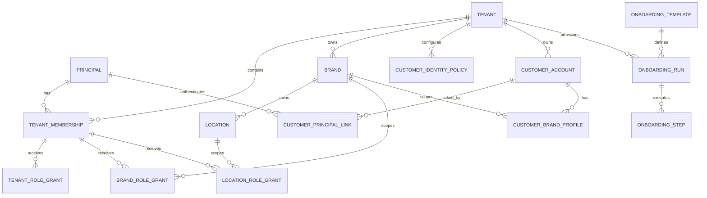
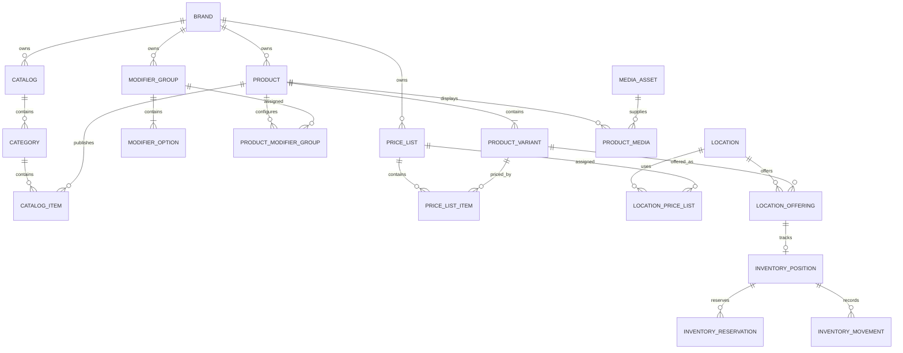
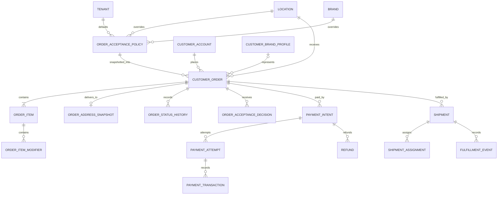
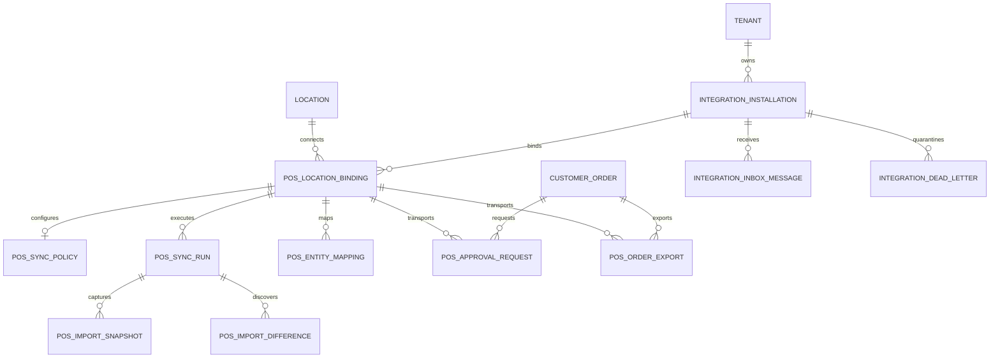
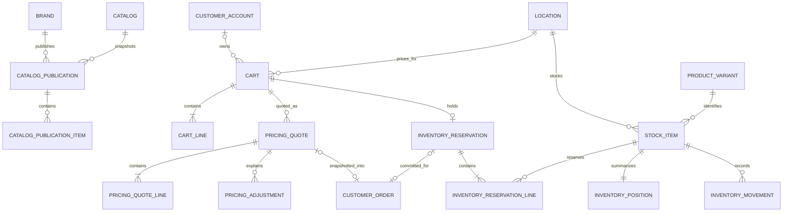
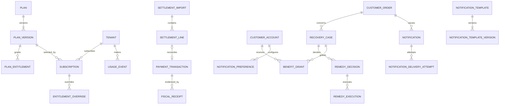
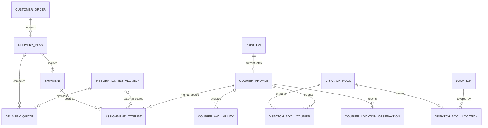
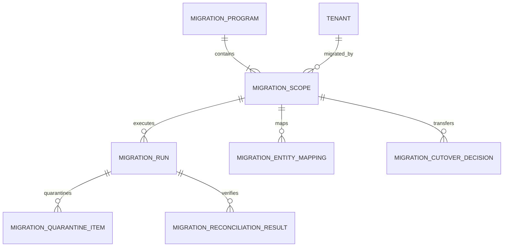

# Logical entity-relationship model

The ERD is split by bounded context so ownership remains readable. Every
tenant-owned entity shown below carries `tenant_id`, even when a relationship
already implies it.

## SaaS, identity, and customer

## Catalog, pricing, inventory, and media

## Orders, payments, and fulfillment

The ADR 0019 half of this diagram is built by migration V0022, under the physical
names below. The logical names above are kept because the payment and fulfilment
halves of the diagram are still targets, and renaming only the built third would
make the diagram harder to read rather than easier.

| Logical entity | Physical table | Notes |
|---|---|---|
| — | `ordering.carts`, `ordering.cart_lines` | Mutable, bound to one location and channel, rebuilt rather than moved. The ADR's `cart_fulfillment` is not created: nothing captures a delivery address yet |
| — | `ordering.checkout_attempts` | The transactional checkout idempotency record |
| `CUSTOMER_ORDER` | `ordering.orders` | One order per accepted quote and per cart, both enforced by unique constraints |
| `ORDER_ITEM` | `ordering.order_lines` | Snapshotted names and amounts; `SELECT`/`INSERT` only |
| `ORDER_ITEM_MODIFIER` | `ordering.order_line_modifiers` | |
| — | `ordering.order_adjustments` | Every step that made up the total, copied from the quote |
| `ORDER_ADDRESS_SNAPSHOT` | `ordering.order_customer_snapshots` | Encrypted per ADR 0029; `UPDATE` granted only for crypto-shredding |
| `ORDER_STATUS_HISTORY` | `ordering.order_state_history` | Append-only |
| `ORDER_ACCEPTANCE_DECISION` | `ordering.approval_decisions` | Every command, including the losers; exactly one `effective` |
| — | `ordering.order_timers` | The durable approval deadline |
| — | `ordering.order_process_states` | One row per order per concern; only `ORDER_INVENTORY` is driven today |

`PAYMENT_INTENT` and everything below it is still a target: ADR 0013 is unbuilt,
and ordering calls a declared-unwired `PaymentIntentPort` in its place.

## POS and provider integration

## Planned target extensions (unimplemented ADRs)

The diagrams below expose the intended relationships needed for migration
coverage. They are governed by ADRs 0013–0034 and do not become accepted
physical tables until the applicable ADR moves through implementation, even
where that ADR's decision status is `Accepted`.

### Catalog publication, cart, quote, and inventory reservation

### SaaS commercial, recovery, fiscal, and notification

### Delivery plan, internal courier, and external partner sourcing

### Migration control and reconciliation

## Required physical constraints

- Unique tenant slug globally.
- Unique brand code and slug within a tenant.
- Unique location code and slug within a brand.
- Unique principal membership per tenant.
- Unique active principal link per tenant in `TENANT_SHARED` mode, or per tenant
  and identity-partition brand in `BRAND_ISOLATED` mode. The same principal may
  link in several tenants and, in isolated mode, several brand partitions.
- Unique customer brand profile per account and brand.
- Composite foreign keys on `(tenant_id, brand_id)` and
  `(tenant_id, brand_id, location_id)`.
- One active acceptance-policy version per tenant, brand, or location scope.
- One effective acceptance decision per order, while retaining all attempted
  decisions.
- Unique provider inbox key and idempotency key per installation.
- Unique POS external entity reference within a location binding and entity
  type.
