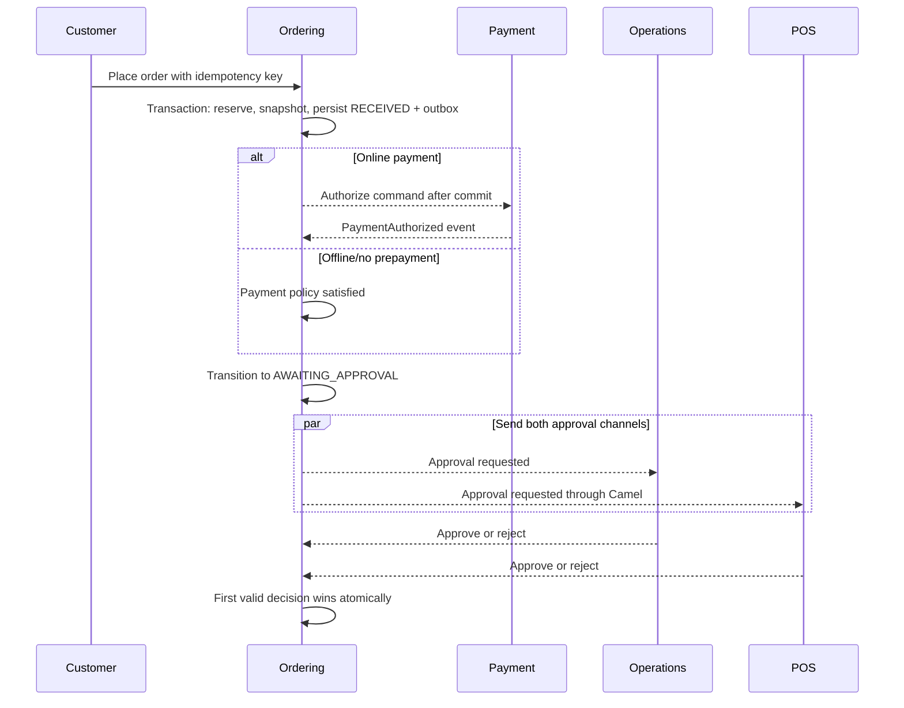
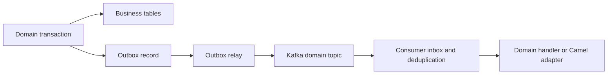

# Core business processes

## Tenant onboarding

1. A platform user chooses an onboarding template and submits legal tenant
   data, default currency/timezone, and customer identity mode.
2. HorecaOS creates the tenant in `PROVISIONING` and records an onboarding run.
3. An idempotent step creates or reconciles the Keycloak Organization and
   stores its immutable external ID.
4. HorecaOS creates brands and their single-brand locations.
5. The tenant owner is linked or invited and receives scoped grants.
6. Defaults resolve for language, currency, order acceptance, payment,
   delivery, and notifications.
7. Integration installations store secret references and perform connection
   checks; secrets are never persisted in HorecaOS tables.
8. Catalog and location imports run as dry runs before applying valid records.
9. Readiness checks verify identity, roles, locations, menus, payments,
   fulfillment, integrations, domains, and required media.
10. Activation is atomic from the control plane's perspective and emits a
    `TenantActivated` event through the transactional outbox.

No Kafka topic, Keycloak realm, database schema, or source-code fork is created
per tenant.

## Automatic order confirmation

1. Resolve and authorize tenant, brand, location, customer, and sales channel.
2. Re-read authoritative catalog, price, promotion, and availability data.
3. Reject client-supplied totals and calculate the order server-side.
4. In one local PostgreSQL transaction under an idempotency key, reserve
   inventory, accept the quote/benefit reservations, create the `RECEIVED`
   order plus immutable customer/address/line/modifier/tax/discount/total/
   currency/policy snapshots, create the local payment intent when needed, and
   write the outbox event.
5. After commit, authorize online payment through the durable payment process;
   no provider HTTP call runs inside the checkout transaction.
6. When payment policy is satisfied, atomically transition the order to
   `CONFIRMED` and commit its consequence events. Offline/no-payment orders may
   confirm immediately after the checkout commit.
7. Capture payment when required, commit inventory, notify the customer,
   request fulfillment, and queue POS export through independent idempotent
   process managers.
8. If POS export exhausts retries, retain the confirmed order and create an
   operational `MANUAL_ACTION_REQUIRED` exception.

## Restaurant approval through Operations and POS

On approval, HorecaOS confirms the order and emits independent commands to capture
payment, commit inventory, and export to the POS unless POS approval already
created the external order. On rejection or safe timeout, HorecaOS emits commands
to release inventory and void/refund according to provider capability, records
a reason, and notifies the customer. Late responses are acknowledged and
audited but do not mutate the order.

The HorecaOS Operations channel is always available as the fallback. A POS binding
that lacks a reliable approval capability cannot be configured as the sole
approval path.

## Daily POS synchronization

1. The scheduler creates a run for each active location binding.
2. Camel calls the provider adapter using the installation's secret reference.
3. HorecaOS stores run metadata and a protected raw import snapshot.
4. External identifiers are resolved through `POS_ENTITY_MAPPING`.
5. Imported rows are normalized into provider-neutral staging records.
6. HorecaOS calculates additions, changes, removals, and mapping conflicts.
7. New products may be applied as drafts. POS-owned operational metadata may
   be auto-applied under an explicit field policy.
8. Customer-facing product content, prices, and availability require review or
   remain unchanged because HorecaOS is authoritative.
9. The run records counts, differences, errors, duration, and checkpoint.
10. Reconciliation alerts on unmapped, duplicated, or destructive changes.

Daily polling is not considered real-time availability. A provider-supported
webhook or frequent incremental poll can supply an availability signal later,
but HorecaOS remains responsible for the effective sellability decision.

## Provider command reliability

1. A domain transaction writes a provider-neutral command to the outbox.
2. The relay publishes it to a domain Kafka topic using the aggregate ID as
   partition key.
3. The consumer persists its inbox/idempotency record.
4. Camel selects the configured provider adapter by capability.
5. Timeouts and retryable failures use bounded exponential retry and circuit
   breaking.
6. Permanent errors or exhausted retries enter a dead letter with a safe
   operations view.
7. Replay uses the original idempotency key and cannot duplicate an external
   charge, order, refund, or shipment.
8. Provider reconciliation resolves uncertain outcomes before another side
   effect is attempted.

## Kafka publication

Topics are domain-oriented, not tenant- or provider-oriented. Every external
event includes event ID/type/version, tenant ID, aggregate ID, correlation ID,
causation ID, occurrence time, trace metadata, and a versioned payload.

## S3 upload and migration

New upload:

1. Authorize the tenant-scoped owner and allocate `MediaAsset` plus an immutable
   generated key.
2. Return a short-lived presigned upload request constrained by content length,
   expected type, and checksum.
3. Validate the uploaded object before marking it available.
4. Generate derivatives asynchronously and serve through private origin access
   or signed delivery.

Legacy migration:

1. Inventory files and database references without changing either.
2. Map every source path to tenant and constrained business owner.
3. Copy under a generated key and verify size and SHA-256 checksum.
4. Create the media relation and retain the legacy path in migration evidence.
5. Enable S3 reads with filesystem fallback, reconcile, then cut over new
   writes and reads separately.
6. Preserve legacy files through the rollback window.

## Planned process extensions

Detailed unimplemented processes for customer merge, catalog publication,
inventory reservation, deterministic quote/checkout, notification delivery,
payment/fiscal/recovery, internal/external courier sourcing, SaaS metering,
frontend journey routing, production recovery, and final cutover live in ADRs
0013–0034.
When a slice begins, promote its accepted process into this canonical document
and reconcile the affected source in `docs/migration-coverage.md`; the ADR alone
does not make the process implemented.
