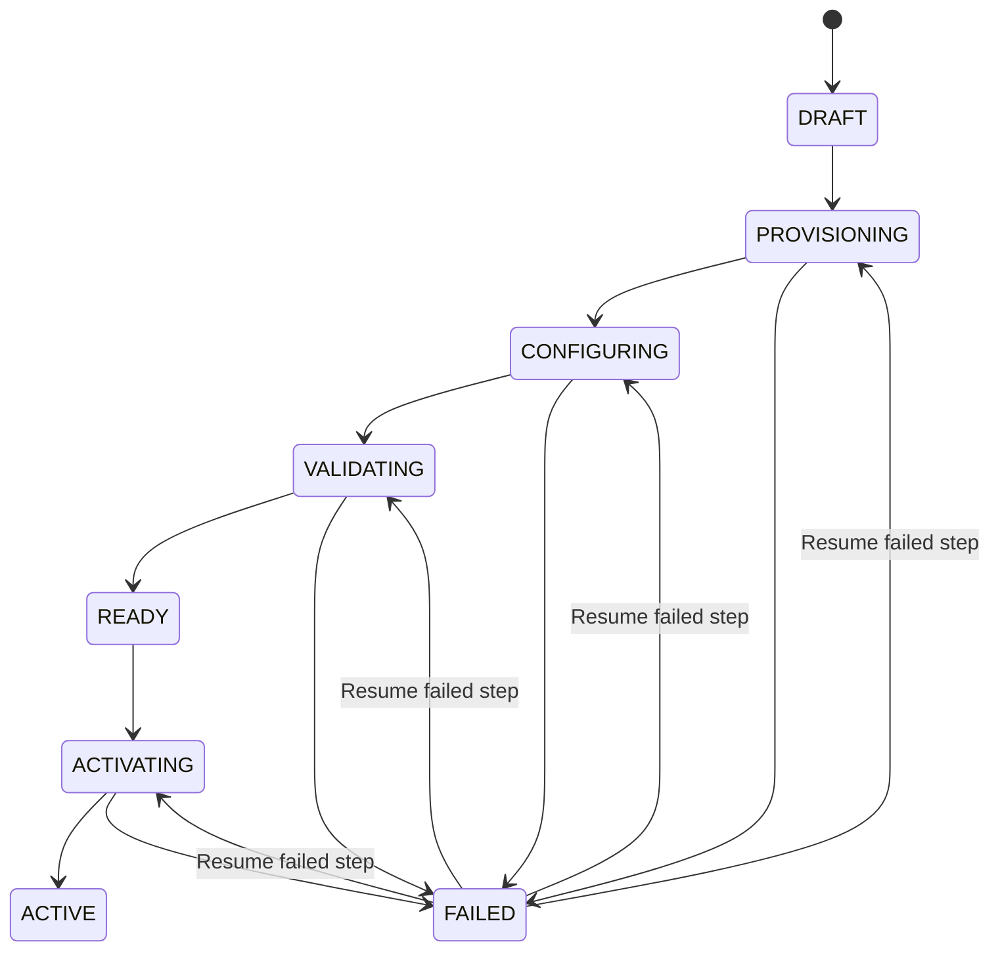
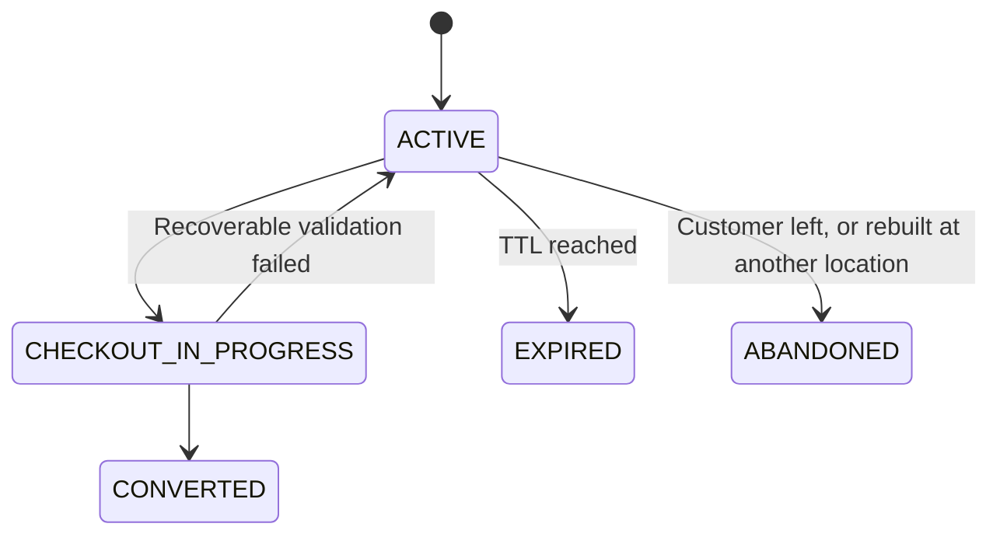
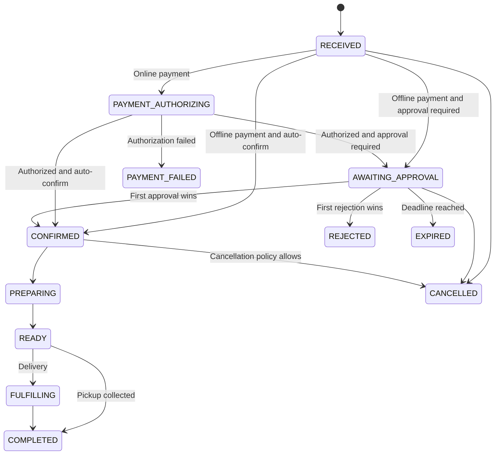
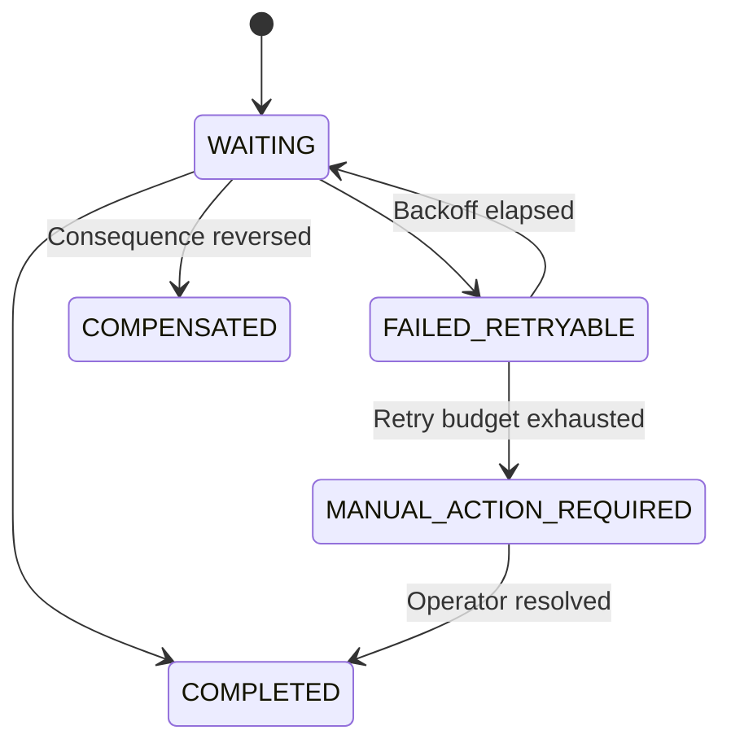
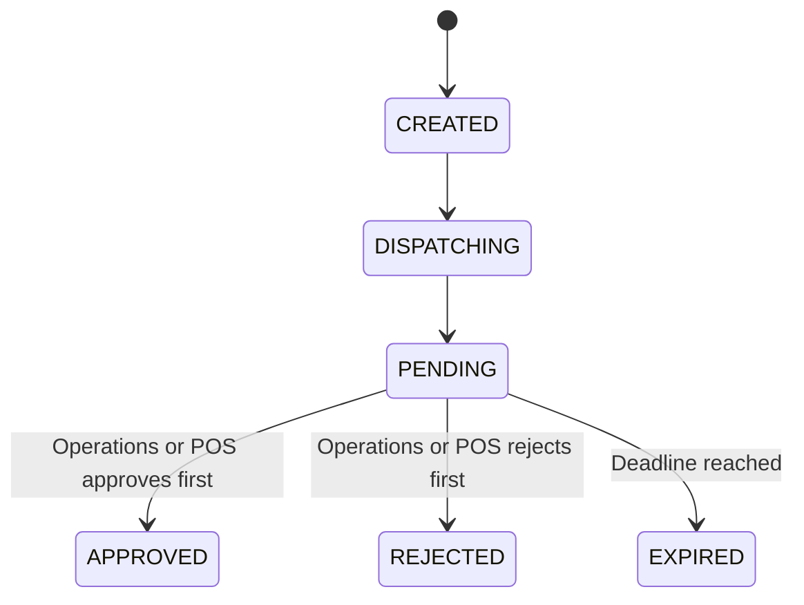
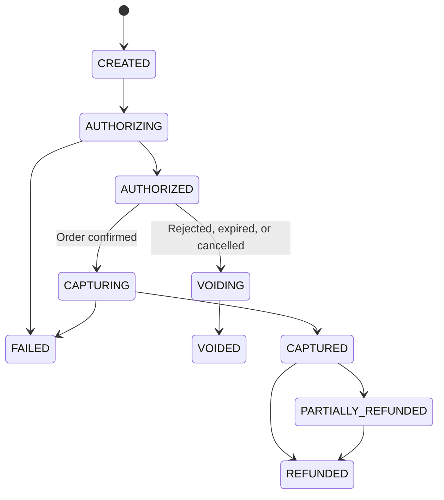
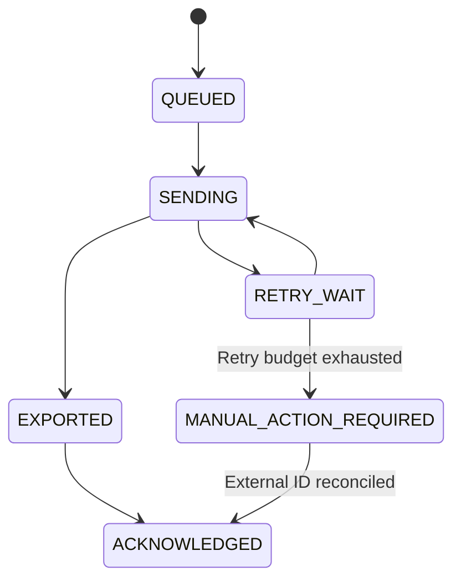
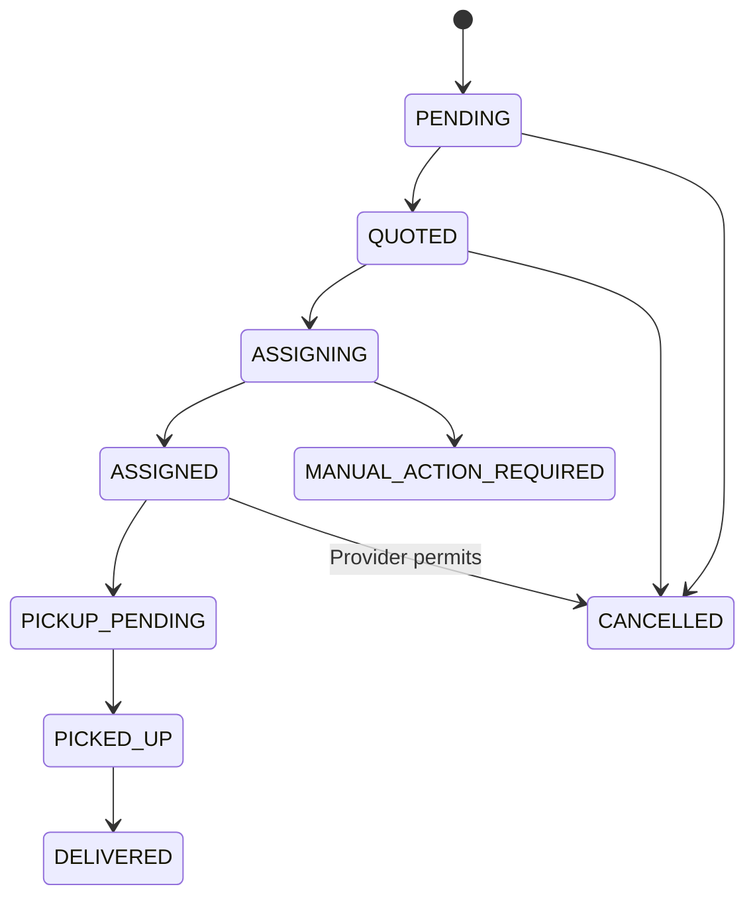
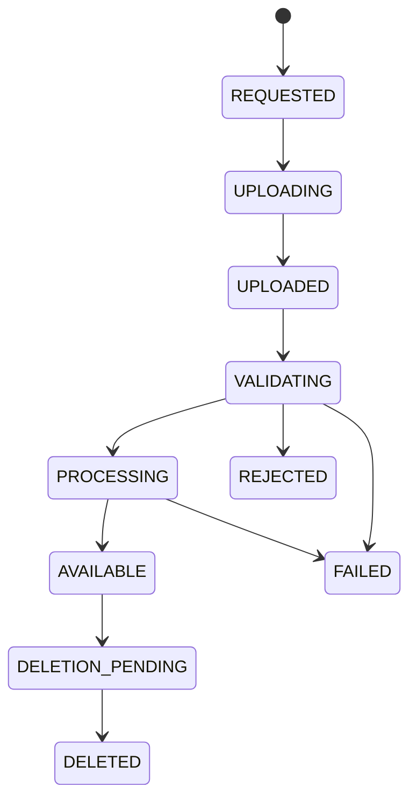

# Domain state machines

State transitions are domain behavior, not arbitrary status assignments. Every
transition records actor, source, timestamp, correlation ID, and reason where
applicable.

## Tenant onboarding

Each onboarding step is idempotent and stores its attempt, checkpoint, result,
and error. A run cannot reach `READY` until all required checks pass.

## Cart lifecycle

A cart is bound to one tenant, brand, location and channel for its whole life. A
location change abandons it and builds a new one, because catalog, availability,
tax, fee and promise all change with the branch. The return edge to `ACTIVE`
matters as much as the forward one: a checkout refused because a dish sold out
must leave the customer with an editable basket.

## Order lifecycle

POS export status is deliberately absent. POS transport failure is an
integration concern and cannot reverse `CONFIRMED`.

This machine is owned by `OrderStatus` and `OrderStateMachine` in
`uz.horecaos.platform.ordering.domain`, and by the `ck_order_status` check
constraint in migration V0022. There is no table a tenant can override and no
ADR 0030 policy key that reaches it: ADR 0036's omission list is explicit that
tenants may not reorder the order lifecycle. A tenant chooses *which* transitions
its orders take, by choosing an acceptance policy; it never chooses which
transitions exist.

Two edges are conditional on the order rather than on the actor.
`READY -> FULFILLING` is delivery only and `READY -> COMPLETED` is pickup and
dine-in only, so a pickup order cannot enter a courier state nobody will advance.
`CONFIRMED -> CANCELLED` exists in the model and is refused by the application in
the first release: its payment, fiscal, POS and fulfilment consequences belong to
ADR 0039, and performing half of them would be worse than refusing.

## Order process managers

One durable row per order per concern (`ordering.order_process_states`), rather
than one saga per order. A stuck POS export must not block payment, notification
and fulfilment for the same order.

The named processes are `ORDER_PAYMENT`, `RESTAURANT_APPROVAL`,
`ORDER_INVENTORY`, `POS_ORDER_EXPORT`, `ORDER_FULFILLMENT`, and
`ORDER_NOTIFICATION`. Only `ORDER_INVENTORY` is driven today — commit on
confirmation, release on rejection, expiry or cancellation. The others are
recognised by the schema and written by nothing, so a row for a process whose ADR
has not landed is refused rather than silently accepted.

The instruction and the business change are written in one transaction, so a
process manager can never be asked to act on a state that was rolled back, and an
order can never reach a state whose consequence nobody was asked to carry out.

## Restaurant approval

An atomic compare-and-set changes `PENDING` to one terminal decision. A later
decision is stored with `effective = false` and cannot change the order.

## Payment

## POS order export

When POS approval itself creates the POS order, the returned external order ID
moves the export directly to `ACKNOWLEDGED`; HorecaOS does not export it twice.

## Delivery shipment

## Media asset

## Planned state extensions

The following ADRs contain lifecycles that must be copied into this canonical
document when their implementation begins:

- ADR 0013: service recovery, refunds, benefits, fiscal receipts/settlement exceptions
- ADR 0014: delivery plans, sourcing jobs, shipments, internal/external assignment
- ADR 0015: customer account merge and identity-policy migration
- ADR 0016: catalog validation/publication
- ADR 0017: inventory reservations and expiry
- ADR 0018: pricing quotes, coupon and benefit reservations
- ADR 0020: notification intent, attempt, uncertainty, and reconciliation
- ADR 0021: SaaS subscription lifecycle
- ADR 0024: migration scope, cutover, rollback window, and retirement

They are references, not accepted state additions. Do not implement an alternate
status vocabulary without updating this file and the governing ADR together.
