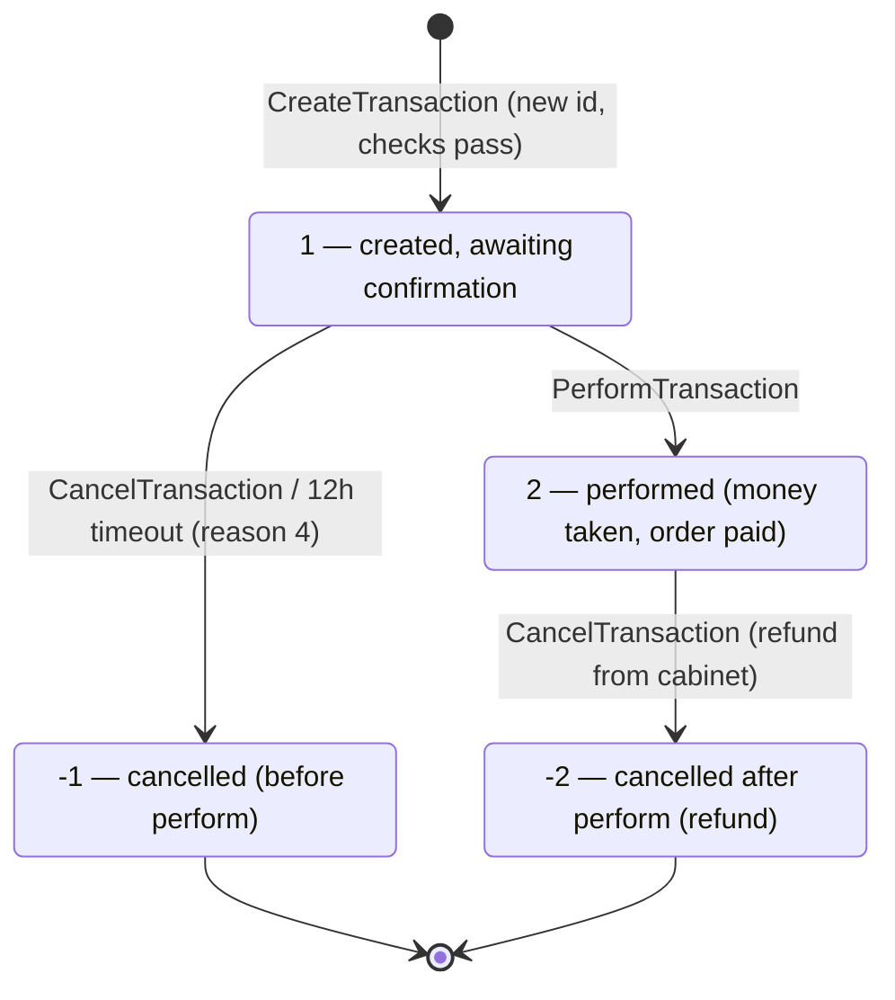

# Payme (Paycom) Merchant API — implementation contract

Source notes taken 2026-08-22 from the live Payme Business developer documentation and
Payme's own reference implementations. Everything below is either quoted from a source or
explicitly marked as inference. Uncertainties are marked inline with **[UNCERTAIN]** and
collected in [§12](#12-collected-uncertainties).

## 0. Sources and how much to trust them

| # | Source | Fetched | Trust |
|---|--------|---------|-------|
| S1 | `https://developer.help.paycom.uz/` (whole site, all 59 sitemap URLs) | 2026-08-22, OK | Primary. Current prose docs, Russian only. |
| S2 | `https://developer.help.paycom.uz/metody-merchant-api/setfiscaldata` | 2026-08-22, OK | Primary. |
| S3 | `https://developer.help.paycom.uz/telegram-bot/` + 3 sub-pages | 2026-08-22, OK | Primary but thin — it is a BotFather click-through guide, not an API spec. |
| S4 | `github.com/PaycomUZ/paycom-integration-java-template` @ `9e92fc1` (2017-08-07, Kotlin/Spring Boot 1.5) | 2026-08-22, cloned OK | **Stale and partly wrong.** Last commit 2017. Useful for constants, misleading for logic. See [§11](#11-where-the-java-template-disagrees-with-the-docs). |
| S5 | `github.com/PaycomUZ/paycom-integration-php-template` (linked from S1 as the other official server example) | 2026-08-22, cloned OK | Better than S4 and far more complete. Where S4 and S5 disagree, S5 usually matches the prose docs. |
| S6 | `https://cdn.payme.uz/help/.../merchant_api/state-graph.png`, `.../telegram_bot/diagram.png` | 2026-08-22, downloaded and read | Primary (the docs' own diagrams). |

Everything loaded. Nothing failed to fetch.

Two navigation quirks of S1 worth knowing if you go back to it:

- The slugs `checkperformtransaction` and `checktransaction` are **swapped**.
  `…/metody-merchant-api/checkperformtransaction` serves the *CheckTransaction* page and
  `…/metody-merchant-api/checktransaction` serves the *CheckPerformTransaction* page. The
  page titles are correct; the URLs are not.
- The site is Docusaurus and server-renders, so `curl` gets full content.

Two vocabulary notes:

- The product is now branded **Payme Business**; the API, the hostnames and the Basic-auth
  login are still **Paycom**. They are the same thing.
- A **касса** ("cashbox"/"web-cashbox") is the merchant account object that owns the
  `merchant_id` and the key. One cashbox = one endpoint + one key.

---

## 1. Shape of the integration

There are two protocols and they run in opposite directions.

- **Merchant API — inbound.** Payme is the client, *you* are the JSON-RPC server. Payme
  POSTs `CheckPerformTransaction` / `CreateTransaction` / `PerformTransaction` /
  `CancelTransaction` / `CheckTransaction` / `GetStatement` (+ optionally `SetFiscalData`)
  to a single endpoint URL you register in the cashbox settings. This document is about
  that. Use it when the customer pays on Payme's own checkout page.
- **Subscribe API — outbound.** You are the client, Payme is the server, at
  `https://checkout.paycom.uz/api` (test: `https://checkout.test.paycom.uz/api`), authed
  with an `X-Auth: <merchant_id>:<key>` header. Card tokenisation (`cards.*`), invoices and
  receipts (`receipts.*`), holds. Out of scope here except where the two meet.

The endpoint is a **single URL**; the method is in the JSON body, never in the path. From
S5's README: if your code lives at `https://example.com/api/index.php`, that exact URL is
what you put in the cashbox `endpoint` setting.

---

## 2. JSON-RPC envelope

Quoting S1 (`/protokol-merchant-api/`): Payme talks to merchant billing over **JSON-RPC 2.0**,
transported as **HTTP/1.1 POST over TLS**, with **named parameters only** (`params` is always
an object, never an array).

### 2.1 Transport requirements (verbatim from S1)

- The merchant server must support TLS v1, v1.1 or v1.2. (This list is old; it does not
  forbid TLS 1.3, but the docs do not mention it. **[UNCERTAIN — U1]**)
- **All responses from the merchant server must carry HTTP status 200.** Any status other
  than 200 is interpreted by Payme as RPC error **-32400**. This includes error responses:
  a JSON-RPC error is still `HTTP 200` with an `error` object in the body.
- Recommended HTTP-server settings: `ssl session cache = 1 MB`, `ssl session timeout ≥ 10 min`,
  `keepalive timeout = 10 min`.

### 2.2 Request

Fields (S1, `/protokol-merchant-api/format-zaprosa`):

| Name | Type | Description |
|---|---|---|
| `method` | String | Method name. |
| `params` | Object | Method parameters. |
| `id` | Integer | Request identifier. |

Documented example, verbatim:

```http
POST https://merchant/pay/ HTTP/1.1
Content-Type: text/json; charset=UTF-8
Authorization: Basic TG9naW46UGFzcw==

{
    "method" : "PerformTransaction",
    "params" : {
        "id" : "53327b3fc92af52c0b72b695",
        "time" : 1399114284039,
        "amount" : 500000,
        "account" : {
            "phone" : "903595731"
        },
    },
    "id" : 2032
}
```

Note three things about that example, all of them real:

1. **There is no `jsonrpc: "2.0"` member on the request.** The docs' request table lists
   only `method`, `params`, `id`. S4's README `curl` does send `"jsonrpc":"2.0"`, and S5's
   `Request` class ignores the field entirely. **Do not require `jsonrpc` on input.**
2. `Content-Type` is `text/json`, not `application/json`. S5's Docker README shows
   `application/json` in its own test call. Accept both, and in practice accept anything —
   parse the body regardless of content type. **[UNCERTAIN — U2]**
3. The example carries a trailing comma (invalid JSON) and shows `time`/`amount`/`account`
   on `PerformTransaction`, which per the method page takes only `id`. It is a doc typo;
   trust the per-method pages.

### 2.3 Response — success

Fields (S1, `/protokol-merchant-api/format-otveta`):

| Name | Type | Description |
|---|---|---|
| `result` | Object | Method result. Absent if the call failed. |
| `id` | Integer | Response id — matches the request id. |

```http
HTTP/1.1 200 OK
Content-Type: text/json; charset=UTF-8

{
    "result" : {
        "id" : "1288",
        "time" : 1399114284039,
        "receivers" : [
            {
                "id" : "5305e3bab097f420a62ced0b",
                "amount" : 500000
            }
        ]
    },
    "id" : 2032
}
```

S5 additionally emits `"jsonrpc": "2.0"` and an explicit `"error": null` on the success path,
and on the error path emits `"result": null` and *omits* `jsonrpc`. Both are accepted by
Payme. Emitting `jsonrpc: "2.0"` on every response is harmless and is what I would do.

### 2.4 Response — error, and the error object

| Name | Type | Description |
|---|---|---|
| `error` | Error | Error description. Absent on success. |
| `id` | Integer | Response id — matches the request id. |

`Error`:

| Name | Type | Description |
|---|---|---|
| `code` | Integer | Error code. |
| `message` | Object | **Localised** error text. Shown to the end user. |
| `data` | Object | Additional information about the error. |

```http
HTTP/1.1 200 OK
Content-Type: text/json; charset=UTF-8

{
    "error" : {
        "code" : -31050,
        "message" : {
            "ru" : "Номер телефона не найден",
            "uz" : "Raqam ro'yhatda yo'q",
            "en" : "Phone number not found"
        },
        "data" : "phone"
    },
    "id" : 2032
}
```

**Localisation rules — this is the part people get wrong.**

- `message` is an **object keyed by language: `ru`, `uz`, `en`**. Not a string.
- For the account-error range **-31050 … -31099 the localised `message` object is
  mandatory**, and `data` **must** contain the *name of the offending `account` sub-field*
  (e.g. `"order_id"`, `"phone"`) — stated on the error page, on the `CheckPerformTransaction`
  page, on the `CreateTransaction` page and on the `PerformTransaction` page.
- For other codes the docs are looser. Payme's own S5 template passes a **plain string** for
  every non-account error (`'Transaction not found.'`) and only builds the `{ru,uz,en}`
  object for account errors. S5's `PaycomException` also **omits** `message` and `data`
  entirely when they are empty. So a bare string is tolerated outside the account range.
- The `ru` text is the one that surfaces to the user in practice, because the Payme
  checkout defaults to `lang=ru`. Fill all three anyway.
- **My recommendation:** always emit the `{ru, uz, en}` object for every error. It is valid
  everywhere and removes the question.
- S4 (Java) emits only a single-string English message via `@JsonRpcError(message = "...")`.
  That is not conformant for the account range. See [§11](#11-where-the-java-template-disagrees-with-the-docs).

### 2.5 Generic / protocol errors (S1, `/protokol-merchant-api/obschie-oshibki`, repeated on `/metody-merchant-api/oshibki-errors`)

| Code | Meaning |
|---|---|
| `-32300` | Request method was not POST. |
| `-32700` | JSON parse error. |
| `-32600` | Required fields missing from the RPC request, or field types do not match the spec. |
| `-32601` | Requested method not found. The method name goes in `data`. |
| `-32504` | Insufficient privileges to run the method. **This is the auth-failure code.** |
| `-32400` | System / internal error (DB down, filesystem down, undefined behaviour). Also what Payme synthesises when your HTTP status ≠ 200. |

Note S5 returns **-32600** for an unparseable body where the docs say **-32700**. The docs
are right; `-32700` for a body that will not parse, `-32600` for a body that parses but is
structurally wrong.

Also note `-32001`, `-32602` exist only in the `SetFiscalData` error table ([§8](#8-setfiscaldata)) and
do not appear elsewhere.

---

## 3. Authentication

From S1, `/protokol-merchant-api/skhema-vzaimodeystviya`:

- **HTTP Basic authentication**, header `Authorization: Basic base64(login:password)`.
  Documented example: `Authorization: Basic TG9naW46UGFzcw==` (that decodes to the
  placeholder `Login:Pass`).
- **The login is the literal string `Paycom`.** S1 says only "ask a Payme technical
  specialist"; S5's config file says it outright — `// Login is always "Paycom"` — and its
  README says "Do not change the `login`, it is always `Paycom`". S4 uses `Paycom` too. So:
  `Paycom`. **[UNCERTAIN — U3: S1 leaves the door open to a per-merchant login; treat `Paycom`
  as the default and make it configurable.]**
- **The password is the cashbox key** issued when the web-cashbox is created, described as a
  **36-character string**. S5's sample key file contains `fkWW6UNrzvzyV6DhrdHJ6aEhr3dRcvJYkaGx`
  — exactly 36 chars. Found in the merchant cabinet under the cashbox's
  *Settings → Developer tools*, which holds two keys: the live **key** and the sandbox
  **TEST_KEY**.
- Payme sends only from these 15 source IPs, and states it uses no others:
  `185.234.113.1` … `185.234.113.15` (contiguous /28-ish block, `.1`–`.15`). Allowlist them
  as defence in depth, never as the only check.

**The exact failure response.** On bad or missing credentials you must return
**HTTP 200** with:

```json
{
    "error": {
        "code": -32504,
        "message": "Insufficient privilege to perform this method."
    },
    "id": 1
}
```

`-32504`, HTTP 200. This is verified twice: S1's sandbox page says the first sandbox test
("Неверная авторизация") expects `-32504` back from every method, and S5's `Merchant::Authorize()`
throws exactly `ERROR_INSUFFICIENT_PRIVILEGE = -32504`. Returning a bare `401` fails the
sandbox — it has no JSON-RPC body and, being ≠ 200, Payme reads it as `-32400`.

Comparison is a plain byte comparison of the decoded `login:key` (S5), so:

- authenticate **before** dispatching the method, and for *every* method including `GetStatement`;
- echo the request `id` in the auth-failure response (S5 does);
- use a constant-time comparison — S5 uses `!=`, which is a timing leak. Do better.

---

## 4. Money and currency

- **Every amount in the Merchant API is an integer number of tiyin** (тийин), the 1/100
  subunit of the Uzbek som. Type `Amount` is defined as "a positive integer, greater than
  zero, representing a sum in tiyin".
- 1 UZS = 100 tiyin. S5's `Format::toSom($coins) = $coins / 100` and
  `Format::toCoins($amount) = round($amount * 100)`.
- The checkout-link docs make it concrete: `a=500 — Сумма платежа 5 сум (в тийинах)`.
  500 tiyin = 5 som.
- **Rounding happens on the merchant side, once, when the order total is converted to
  tiyin.** `round(amount * 100)`. Payme never rounds an inbound `amount` for you and never
  sends a fractional one. Store your order total in tiyin (integer) as the canonical value
  and you avoid the class of bug entirely; if you store som as decimal, the equality check
  in `CheckPerformTransaction` must compare `round(order_total_som * 100) == params.amount`
  and not float-compare.
- The cashbox has configurable **min and max payment amounts**; violations are rejected at
  checkout, before your endpoint is ever called, with `-31611` (below minimum) / `-31612`
  (above maximum) — see [§9.5](#95-checkout-side-errors).
- The Telegram bot cashbox additionally has a **"round to som"** (`Округлять до сумов`)
  checkbox and min/max amounts entered **in som**. **[UNCERTAIN — U4: the docs do not say
  whether that option rounds up, down or to nearest, nor whether it changes what your
  endpoint receives. It only exists for bot cashboxes.]**
- Currency: implicitly UZS everywhere. The only currency knob anywhere is the checkout link's
  `cr` parameter, "currency code in ISO format", with no value list. **[UNCERTAIN — U5]**

---

## 5. The transaction state machine

### 5.1 States (`State`, S1 `/metody-merchant-api/tipy-dannykh`)

| Code | Meaning (verbatim) | Reachable from |
|---:|---|---|
| `1` | Transaction successfully created, awaiting confirmation | initial state 0 |
| `2` | Transaction successfully completed | 1 |
| `-1` | Transaction cancelled | 1 |
| `-2` | Transaction cancelled after completion | 2 |

State `0` is not a stored state — it is the notional "does not exist yet". S4 names it
`STATE_NEW(0)` but never persists it.

**The sign is the whole point: a negative state means cancelled.** Magnitude tells you *how
far the transaction had got* when it was cancelled — `-1` = cancelled before money moved,
`-2` = cancelled after money moved. There is no "cancelled state 0". Any code that tests
`state == -1` for "is it cancelled" is wrong; test `state < 0`.

### 5.2 The graph

The docs' own diagram (`state-graph.png`) is exactly this — an initial node, then 1 → 2,
1 → -1, 2 → -2, and nothing else:



**Legal transitions — and only these four:**

| From | To | Trigger | Notes |
|---|---|---|---|
| (none) | `1` | `CreateTransaction` with an id you have never seen | Only after `CheckPerformTransaction`-equivalent validation passes. |
| `1` | `2` | `PerformTransaction` | Set `perform_time`, mark the order paid. |
| `1` | `-1` | `CancelTransaction`, any `reason`; or your own 12-hour timeout sweep with `reason = 4` | Free the order/stock. |
| `2` | `-2` | `CancelTransaction`, in practice `reason = 5` (refund) | Only if your business rules allow it. |

**Illegal transitions and the correct rejection:**

| Attempt | Return |
|---|---|
| `PerformTransaction` on `-1` or `-2` | `-31008` |
| `PerformTransaction` on `2` | **not an error** — idempotent replay, return the stored `transaction`, `perform_time`, `state: 2` |
| `CancelTransaction` on `-1` or `-2` | **not an error** — idempotent replay, return stored `transaction`, `cancel_time`, `state` |
| `CancelTransaction` on `2` when goods/services were fully delivered | `-31007` |
| `CreateTransaction` with a known id whose state ≠ 1 | `-31008` |
| `CreateTransaction` with a known id in state 1 that has expired | cancel it (`-1`, reason 4) then `-31008` |
| Any method with an unknown transaction id (except `CreateTransaction`) | `-31003` |

**Terminal states: `-1` and `-2`.** `2` is *successful* but not terminal — a refund can still
take it to `-2`. Treat `2` as "settled, reversible"; treat `< 0` as final.

### 5.3 What `-2` means for money already taken

`-2` is a **refund of an already-captured payment**. The card was charged, `PerformTransaction`
succeeded, and afterwards the transaction was reversed. Concretely:

- Payme initiates it — from S1's `CancelTransaction` page: *"If for some reason the buyer did
  not receive the goods paid for by card, or changed their mind, the merchant refunds the
  buyer **in the merchant cabinet**."* The cabinet's refund button calls your
  `CancelTransaction`. **A refund is only possible if `CancelTransaction` is implemented** —
  the docs say so explicitly. An unimplemented `CancelTransaction` means the merchant
  literally cannot refund anyone.
- The money goes back to the customer's card. Your side must reverse fulfilment: un-mark the
  order paid, restock, revoke whatever entitlement the payment bought, and record the
  reversal in your ledger. Nothing about `-2` is advisory — the funds are gone from your
  settlement.
- The reason code accompanying a refund is normally `5` ("Возврат денег"), but any reason may
  arrive.
- **`-31007` is your veto**, and the only one you get. If the goods have been irreversibly
  delivered (a consumed service, a topped-up balance, a downloaded file), return `-31007`
  from `CancelTransaction` and the state stays `2`. Both templates gate this on an
  `allowCancel()` / `order.delivered` predicate. Decide that predicate deliberately: an
  over-permissive one gives away goods, an over-strict one traps customer money and forces
  manual intervention by Payme staff.
- Once you have answered `-31007`, do not later self-transition to `-2`. Payme will call
  `CancelTransaction` again if the situation changes.

### 5.4 Cancellation reasons (`Reason`)

| Code | Meaning |
|---:|---|
| `1` | One or more receivers not found or inactive in Payme Business |
| `2` | Error during the debit operation in the processing centre |
| `3` | Transaction execution error |
| `4` | **Cancelled by timeout** |
| `5` | Money returned (refund) |
| `10` | Unknown error |

Store the reason verbatim; return it in `CheckTransaction` and `GetStatement`. It is `null`
for a transaction that was never cancelled.

### 5.5 Receipt (чек) states — Payme's internal side

Not your state machine, but they show up in support conversations and in the cabinet. From
S1's data-types page:

| Code | Meaning |
|---:|---|
| `0` | Receipt created, awaiting payment confirmation |
| `1` | First check stage — creating the transaction in merchant billing |
| `2` | Debiting the card |
| `3` | Closing the transaction in merchant billing |
| `4` | Receipt paid |
| `5` | Receipt held (hold) |
| `6` | Hold command received; then moves to 5. **If a receipt is stuck here for long, contact Payme technical support.** |
| `20` | Receipt paused for manual intervention |
| `21` | Receipt queued for cancellation |
| `30` | Receipt queued for closing the transaction in merchant billing |
| `50` | Receipt cancelled |

Receipt state 4 ≈ your transaction state 2. Receipt state 20 is the "Payme staff are driving
this by hand" state referenced in [§6.3](#63-what-happens-if-you-never-answer).

---

## 6. Timeouts

### 6.1 The transaction timeout — 12 hours

Verbatim, from S1's `CreateTransaction` page:

> Отмена транзакции по таймауту производится через **12 часов — 43 200 000 миллисекунд** с
> момента создания транзакции в Payme Business. После отмены по таймауту транзакция
> переходит в состояние: "Транзакция отменена" (**-1**), с причиной: "Отмена по таймауту"
> (**4**).

So: **43,200,000 ms = 12 hours**, measured **from the moment the transaction was created in
Payme Business** — i.e. from the `time` parameter that `CreateTransaction` handed you, *not*
from your own `create_time`. Both templates hard-code the constant
(`Transaction::TIMEOUT = 43200000` in S5, `private val time_expired = 43_200_000L` in S4);
S4 measures it against Payme's `paycomTime` (correct), S5 measures it against the merchant's
own `create_time` (wrong reference point, see [§11](#11-where-the-java-template-disagrees-with-the-docs)).

**Required behaviour.** Expiry is *your* job — Payme does not reliably come and cancel a
stale transaction for you, and an implementation that ignores this strands both the money
and the customer's order:

1. On `CreateTransaction` for a **known** id in state `1`: if `now - params.time > 43_200_000`,
   move it to state `-1` with `reason = 4`, set `cancel_time`, release the order, and return
   error `-31008`.
2. On `PerformTransaction` for a transaction in state `1`: same check first. If expired,
   cancel it (`-1`, `reason 4`) and return `-31008`. **Never perform an expired transaction.**
3. Run a background sweep that cancels state-`1` transactions older than 12 h with
   `reason = 4` and frees the reserved order, so that stock is not held forever by a customer
   who closed the tab. Payme's templates only expire lazily, on the next inbound call — which
   for an abandoned checkout never comes. This sweep is an inference from the requirement to
   "reserve the order until payment or cancellation by timeout"; it is not spelled out.
   **[UNCERTAIN — U6]**
4. A transaction cancelled by timeout must still be reported by `CheckTransaction` and
   `GetStatement`, with `state = -1` and `reason = 4`.

### 6.2 The other documented timeouts

| What | Value | Source |
|---|---|---|
| Transaction expiry | 43 200 000 ms (12 h) | `CreateTransaction` page |
| `answerPreCheckoutQuery` deadline (Telegram) | **10 seconds** after the pre-checkout query | Telegram bot payment-diagram page |
| Recommended TLS session timeout | ≥ 10 minutes | interaction-schema page |
| Recommended keepalive timeout | 10 minutes | interaction-schema page |
| Checkout `callback_timeout` / `ct` | delay before the payer is redirected back after a successful payment; "default 15", declared in **milliseconds** | POST- and GET-checkout pages |

The `callback_timeout` default of "15" is stated in the same breath as "in milliseconds",
which would be a 15 ms delay — almost certainly the unit or the default is misdocumented and
15 **seconds** is meant. **[UNCERTAIN — U7]** Set it explicitly rather than relying on the default.

### 6.3 What happens if you never answer

There is **no published HTTP timeout** for how long Payme waits on your endpoint, and no
published retry schedule. What the docs do say (interaction-schema page):

- If the response to `CreateTransaction` is lost, **Payme repeats the request with identical
  parameters**.
- If the response to `PerformTransaction` is lost, **Payme repeats the request with identical
  parameters**.
- If an error occurs during the debit operation, Payme cancels the transaction by calling
  `CancelTransaction`.
- *"If Payme Business does not receive a response from the application for a long time, the
  payment process is suspended and the transaction is managed manually — by a Payme Business
  employee."* (That is receipt state `20`.)

The sandbox page pins the retry down to a testable claim: **`CreateTransaction`,
`PerformTransaction` and `CancelTransaction` are each sent twice, and the response to the
repeat must be identical to the first.** So:

> **Idempotency is a hard requirement, not an optimisation.** Key every mutating handler on
> `params.id` (the Payme transaction id), and make the second call return the stored result
> rather than doing the work again. `CheckPerformTransaction` and `CheckTransaction` are
> naturally idempotent; the other three must be made so.

**[UNCERTAIN — U8: the numeric response timeout and the retry backoff are not published.]**
Budget your handlers well under a second and make them safe to retry.

---

## 7. The methods

All six of `CheckPerformTransaction`, `CreateTransaction`, `PerformTransaction`,
`CancelTransaction`, `CheckTransaction`, `GetStatement` are listed on the current
`/metody-merchant-api/` index. `SetFiscalData` is documented as a seventh, optional one.
`ChangePassword` exists in both templates but **is not in the current docs** — see [§7.8](#78-changepassword--historical).

### 7.0 Common data types

| Type | Definition (verbatim from S1) |
|---|---|
| `ID` | A **24-character** string, a unique identifier of an object in the Payme system. |
| `Timestamp` | A positive integer of **13 digits** — **milliseconds** since 1970-01-01 UTC. |
| `Amount` | A positive integer > 0, a sum **in tiyin**. |
| `Account` | A JSON object; the set of fields is defined by the merchant's business logic. |
| `Receiver` | `{ id: ID (cashbox id), amount: Amount }` |
| `State` | See [§5.1](#51-states-state-s1-metody-merchant-apitipy-dannykh). |
| `Reason` | See [§5.4](#54-cancellation-reasons-reason). |

(S5's schema declares `paycom_transaction_id VARCHAR(25)` — 24 chars plus slack. Do not size
the column at 24 exactly if you want headroom.)

Documented `Account` examples:

```json
// mobile operator
{ "account": { "phone": "903595731" } }
// ISP
{ "account": { "login": "shsts2645135" } }
// online shop
{ "account": { "user": "2599", "order": "AC-532" } }
```

The `Transaction` object (used by `GetStatement`):

| Name | Type | Description |
|---|---|---|
| `id` | ID | Payme transaction id |
| `time` | Timestamp | Payme's creation time |
| `amount` | Amount | tiyin |
| `account` | Account | customer account |
| `create_time` | Timestamp | creation time **in merchant billing** |
| `perform_time` | Timestamp | perform time in merchant billing |
| `cancel_time` | Timestamp | cancel time in merchant billing |
| `transaction` | String | merchant-side transaction number/id; format is the merchant's choice |
| `state` | State | |
| `reason` | Reason | nullable |
| `receivers` | Receiver[] | optional; omit or `null` when the app owner is the sole receiver |

---

### 7.1 `CheckPerformTransaction`

*"Verify that a financial transaction can be created."* Called first, from the checkout page,
before any money moves. If payment is possible it returns `allow`; otherwise it returns an
error.

The docs add a strong instruction: at this stage you should **check every system that
`CreateTransaction` and `PerformTransaction` will need**; if any of them is degraded, those
later methods must return `-32400`.

**Request**

| Name | Type | Description |
|---|---|---|
| `amount` | Amount | payment sum in tiyin |
| `account` | Account | customer account |

```json
{
    "method" : "CheckPerformTransaction",
    "params" : {
        "amount" : 500000,
        "account" : { "phone" : "903595731" }
    }
}
```

**Response**

| Name | Type | Description |
|---|---|---|
| `allow` | Boolean | `true` → the transaction may be performed. Otherwise the method returns `-31001` or `-31050…-31099`. |

```json
{ "result" : { "allow" : true } }
```

**Errors (documented for this method):** `-31001` (wrong amount), `-31050…-31099` (account
input errors; localised `message` mandatory, `data` = the account sub-field name).

Note that **`-31008` is not in this method's documented error list**, yet Payme's own S5
template returns `-31008` from `CheckPerformTransaction` in two situations (another
active/completed transaction exists for this order; the order is not in "waiting for
payment" state). See the mapping table in [§10](#10-account--order-lookup-semantics-the-core-of-the-integration).

**Optional `additional` object.** You may return extra info to display on the checkout page:

```json
{
    "result": {
        "allow": true,
        "additional": { "field_name": "field_value" }
    }
}
```

The docs require you to **tell your Payme technical contact** if you start returning `additional`.

**Optional `detail` object — fiscalisation.** If your cashbox is fiscalised, return the item
lines here so Payme can register the fiscal receipt with the tax authority:

```json
{
    "result": {
        "allow": true,
        "additional": { "field_name": "field_value" },
        "detail": {
            "receipt_type" : 0,
            "shipping": {
                "title": "Доставка до ттз-4 28/23",
                "price": 500000
            },
            "items": [
                {
                    "discount": 10000,
                    "title": "Помидоры",
                    "price": 505000,
                    "count": 2,
                    "code": "00702001001000001",
                    "units": 241092,
                    "vat_percent": 15,
                    "package_code": "123456"
                }
            ]
        }
    }
}
```

`detail`:

| Name | Type | Description | Required |
|---|---|---|---|
| `receipt_type` | Number | Sale/Return = 0 | yes |
| `shipping` | Object | delivery (`title`, `price` in tiyin) | no |
| `items` | Array | item lines | yes |

`items[]`:

| Name | Type | Description | Required |
|---|---|---|---|
| `discount` | Number | discount **for the whole line** (accounting for `count`), in tiyin | no |
| `title` | String | product name | yes |
| `price` | Number | price **per unit** in tiyin | yes |
| `count` | Number | quantity | yes |
| `code` | String | **IKPU** — the national product/service classification code | yes |
| `units` | Number | unit-of-measure code (varies by product type) | **no** on this page |
| `package_code` | String | package code, found in the IKPU details on the tax portal | yes |
| `vat_percent` | Number | VAT percentage for this line | yes |

Note the internal contradiction the docs carry twice: `receipt_type` is described as
"Sale/Return = 0", i.e. one value for both directions, which cannot be right for a return.
**[UNCERTAIN — U9]** Likewise `items` is "required" here and "optional" on the checkout-POST
page. **[UNCERTAIN — U10]**

Arithmetic that has to hold, and which the docs never state: `sum(price*count - discount)`
across items, plus `shipping.price`, should equal `amount`. **[UNCERTAIN — U11 — inferred,
not documented.]** Get it wrong and the fiscal receipt will not match the charge.

---

### 7.2 `CreateTransaction`

*"Create a financial transaction."* Returns the list of payment receivers; when the payment
initiator is the sole receiver, `receivers` may be omitted or `null`. If the transaction
already exists, the merchant app performs a basic check on it and returns the result.

**Implementation requirements (verbatim list from S1):**

- Store transactions in **permanent storage**.
- **Check the payer account in `account`.** If not found, return `-31050…-31099`.
- **Check that the payment amount matches the invoiced amount.**
- **Reserve the buyer's order and every item in it** until payment or cancellation by timeout.
- **Make it impossible for the buyer to modify the order.**
- Set unpaid orders to status **"awaiting payment"**.

**Request**

| Name | Type | Description |
|---|---|---|
| `id` | ID | Payme transaction id |
| `time` | Timestamp | Payme's transaction creation time |
| `amount` | Amount | tiyin |
| `account` | Account | customer account |

```json
{
    "method" : "CreateTransaction",
    "params" : {
        "id" : "5305e3bab097f420a62ced0b",
        "time" : 1399114284039,
        "amount" : 500000,
        "account" : { "phone" : "903595731" }
    }
}
```

**Response**

| Name | Type | Description |
|---|---|---|
| `create_time` | Timestamp | creation time **in the merchant system** |
| `transaction` | String | the merchant-side transaction id; format is yours |
| `state` | State | `1` |
| `receivers` | Receiver[] | optional; omit or `null` for a direct payment |

```json
// direct payment — everything goes to the app owner
{
    "result" : {
        "create_time" : 1399114284039,
        "transaction" : "5123",
        "state" : 1
    }
}

// split (chain) payment — 2 000 som to the owner, 3 000 som to another supplier
{
    "result" : {
        "create_time" : 1399114284039,
        "transaction" : "5123",
        "state" : 1,
        "receivers" : [
            { "id" : "5305e3bab097f420a62ced0b", "amount" : 200000 },
            { "id" : "4215e6bab097f420a62ced01", "amount" : 300000 }
        ]
    }
}
```

`receivers[].id` is a **cashbox id**, and the amounts are in tiyin and must sum to `amount`.
**[UNCERTAIN — U12: the docs never state the sum constraint, though the example satisfies it.]**

**Errors:** `-31001`, `-31008`, `-31050…-31099`.

**Required control flow** (the union of the docs, S5, and the sandbox scenarios):

```
CreateTransaction(id, time, amount, account):
  1. look up existing transaction by Payme id
  2. if found:
       if state != 1                        -> -31008
       if now - time > 43_200_000           -> cancel(-1, reason 4); -31008
       else                                 -> return the STORED create_time/transaction/state  (idempotent replay)
  3. if not found:
       resolve order from account           -> -31050..-31099 on failure
       check amount                         -> -31001 on mismatch
       check no OTHER active(1)/completed(2) transaction exists for this order
                                            -> -31008   (see §10 for the code dispute)
       check order state is payable         -> -31008
       reserve the order, freeze it, set "awaiting payment"
       persist state 1, create_time = now
       return { create_time, transaction, state: 1 }
```

Step 3's "no other active transaction for this order" check is the one the sandbox tests
explicitly: *"a request to `CreateTransaction` with a new transaction and the account state
'awaiting payment' → error `-31008`: 'Operation cannot be performed'"*.

---

### 7.3 `PerformTransaction`

*"Credits funds to the merchant account and sets the order status to 'paid'."*

**Request**

| Name | Type | Description |
|---|---|---|
| `id` | ID | Payme transaction id |

```json
{ "method" : "PerformTransaction", "params" : { "id" : "5305e3bab097f420a62ced0b" } }
```

**Response**

| Name | Type | Description |
|---|---|---|
| `transaction` | String | merchant-side transaction id |
| `perform_time` | Timestamp | perform time in merchant billing |
| `state` | State | `2` |

```json
{
    "result" : {
        "transaction" : "5123",
        "perform_time" : 1399114284039,
        "state" : 2
    }
}
```

**Errors:** `-31003` (transaction not found), `-31008` ("cannot perform this operation — see
the diagram"), `-31050…-31099`.

**Required control flow:**

```
PerformTransaction(id):
  transaction = find(id)            ; if none -> -31003
  switch state:
    1: if expired(now - paycom_time > 43_200_000) -> cancel(-1, reason 4); -31008
       else: mark order PAID, perform_time = now, state = 2, persist
             return { transaction, perform_time, state: 2 }
    2: return the STORED { transaction, perform_time, state: 2 }   (idempotent replay)
    default (-1, -2): -31008
```

**This is the call that means "the money is yours."** Fulfilment, ledger posting and the
customer-facing "paid" flag hang off here, not off the browser returning to your `callback`
URL. Do the state change and the order-status change **in one database transaction** — a
crash between them leaves a paid Payme transaction against an unpaid order, and Payme's
retry will then hit the `state == 2` branch and cheerfully report success.

---

### 7.4 `CancelTransaction`

*"Cancels both a created and a performed transaction."*

**Request**

| Name | Type | Description |
|---|---|---|
| `id` | ID | Payme transaction id |
| `reason` | Reason | cancellation reason |

```json
{
    "method" : "CancelTransaction",
    "params" : { "id" : "5305e3bab097f420a62ced0b", "reason" : 1 }
}
```

**Response**

| Name | Type | Description |
|---|---|---|
| `transaction` | String | merchant-side transaction id |
| `cancel_time` | Timestamp | cancellation time |
| `state` | State | `-1` or `-2` |

```json
{
    "result" : {
        "transaction" : "5123",
        "cancel_time" : 1399114284039,
        "state" : -2
    }
}
```

**Errors:** `-31003` (not found), `-31007` (*"Order fulfilled. The transaction cannot be
cancelled — the goods or service were delivered to the buyer in full."*)

**Required control flow:**

```
CancelTransaction(id, reason):
  transaction = find(id)            ; if none -> -31003
  switch state:
    -1, -2: return the STORED { transaction, cancel_time, state }   (idempotent replay)
     1:     state = -1; cancel_time = now; reason = reason
            release the order reservation, set order CANCELLED
            return { transaction, cancel_time, state: -1 }
     2:     if !allowCancel(order)  -> -31007
            state = -2; cancel_time = now; reason = reason
            reverse fulfilment, set order CANCELLED
            return { transaction, cancel_time, state: -2 }
```

`allowCancel()` is your business rule. S5 ships it returning `false` — refuse everything —
with a `todo:`; S4 uses `order.delivered`. Neither is a policy, both are placeholders.

Refunds initiated from the merchant cabinet arrive here. See [§5.3](#53-what--2-means-for-money-already-taken).

---

### 7.5 `CheckTransaction`

*"Check the state of a financial transaction."*

**Request**

| Name | Type | Description |
|---|---|---|
| `id` | ID | Payme transaction id |

**Response**

| Name | Type | Description |
|---|---|---|
| `create_time` | Timestamp | creation time in merchant billing |
| `perform_time` | Timestamp | perform time in merchant billing |
| `cancel_time` | Timestamp | cancel time in merchant billing |
| `transaction` | String | merchant-side transaction id |
| `state` | State | |
| `reason` | Reason | cancellation reason, or `null` |

```json
{
    "result" : {
        "create_time" : 1399114284039,
        "perform_time" : 1399114285002,
        "cancel_time" : 0,
        "transaction" : "5123",
        "state" : 2,
        "reason" : null
    }
}
```

**Errors:** `-31003` only. `CheckTransaction` never mutates anything — do not expire a
transaction from inside it.

Note the example: **`cancel_time` is `0`, not `null`, when the transaction was never
cancelled**, while `reason` *is* `null`. Both templates emit `null` for unset timestamps.
Follow the docs — emit `0` for unset `create_time`/`perform_time`/`cancel_time` and `null`
for an unset `reason`. **[UNCERTAIN — U13]**

---

### 7.6 `GetStatement`

*"Information about merchant transactions", used for reconciliation (акты сверки) between
merchant and Payme.* The docs are emphatic: **"Реализация метода GetStatement обязательна!"
— implementing `GetStatement` is mandatory.**

**Implementation requirements (verbatim):**

- Search **by the transaction creation date in the Payme system** — the date passed by
  `CreateTransaction` (i.e. `params.time`, *not* your own `create_time`).
- The list must contain **all transactions created after a successful `CreateTransaction`**.
  It must **not** contain transactions whose `CreateTransaction` ended in an error.
- The list must contain transactions from `from` to `to` **inclusive** — everything satisfying
  `from <= time <= to` — **sorted by creation date ascending**. If the period has no
  transactions, return an empty list.

Note what that requires and what it forbids: **every** state goes in the statement —
`1`, `2`, `-1` and `-2` alike. It is a ledger, not a list of successes.

**Request**

| Name | Type | Description |
|---|---|---|
| `from` | Timestamp | period start |
| `to` | Timestamp | period end |

```json
{ "method" : "GetStatement", "params" : { "from" : 1399114284039, "to" : 1399120284000 } }
```

**Response**

The docs' response table names the field `transaction` (`Transaction[]`), but **every example
and both reference implementations use the plural key `transactions`**. Use `transactions`.
The singular in the table is a doc typo.

```json
{ "result" : { "transactions" : [] } }
```

```json
{
    "result" : {
        "transactions" : [
            {
                "id" : "5305e3bab097f420a62ced0b",
                "time" : 1399114284039,
                "amount" : 500000,
                "account" : { "phone" : "903595731" },
                "create_time" : 1399114284039,
                "perform_time" : 1399114285002,
                "cancel_time" : 0,
                "transaction" : "5123",
                "state" : 2,
                "reason" : null,
                "receivers" : [
                    { "id" : "5305e3bab097f420a62ced0b", "amount" : 200000 },
                    { "id" : "4215e6bab097f420a62ced01", "amount" : 300000 }
                ]
            }
        ]
    }
}
```

`account` in the statement must be the **same object shape you were sent**, so it can be
matched back to your order.

**Errors:** none documented. S5 validates the period and returns `-31050` for a missing
`from`/`to` or `from >= to`, with `data` set to `"from"` — a reuse of the account range that
is not sanctioned by the docs. **[UNCERTAIN — U14]** I would return `-32600` for a
structurally invalid period instead, which is what that code is for.

Watch the volume: a naive implementation of a month-wide `GetStatement` over a large table
will time out. Index on the Payme `time` column.

---

### 7.7 `SetFiscalData`

See [§8](#8-setfiscaldata).

### 7.8 `ChangePassword` — historical

Both S4 and S5 implement a seventh method:

```
ChangePassword(password: String) -> { "success": true }
```

It rotates the Basic-auth key. It appears in **neither** the current `/metody-merchant-api/`
index **nor** the current error tables; S4's own code comments link to the dead
`paycom.uz/api/#merchant-api-metody-changepassword-…` anchor. S5 returns `-31050` if the
password is missing and `-32504` if the new password equals the current one.

**I believe it is deprecated.** Do not build a key-rotation flow around it. But: a method
you do not implement must return `-32601` with the method name in `data`, so make sure your
dispatcher's default branch is right, rather than 500-ing on an unexpected method. **[UNCERTAIN — U15]**

---

## 8. `SetFiscalData`

**Direction: inbound**, same endpoint, same envelope, same Basic auth. It is how the fiscal
receipt registered with the tax authority (ОФД) gets back to you.

**When it is called** (verbatim): *"The request is sent to the supplier's billing **after the
receipt moves to a successful status**, regardless of which protocol is implemented."* The
docs also say plainly: **"Данный метод не обязателен к реализации"** — implementing it is not
mandatory. It fires for both directions of money: `type: "PERFORM"` after a payment,
`type: "CANCEL"` after a cancellation/refund.

**Request**

| Name | Type | Description |
|---|---|---|
| `id` | String | unique receipt id in Payme's database |
| `type` | String | `"PERFORM"` (payment) or `"CANCEL"` (cancellation) |
| `fiscal_data` | FiscalData | fiscalisation data |

`FiscalData`:

| Name | Type | Description |
|---|---|---|
| `receipt_id` | String | unique sequential payment number for the Virtual Fiscal Module |
| `status_code` | Number | status code ("list of codes below" — **the list is not actually present**) |
| `message` | String | detailed error info if registering with the ОФД failed |
| `terminal_id` | String | Virtual Fiscal Module number |
| `fiscal_sign` | String | **the fiscal sign (ФП) of the payment receipt** |
| `qr_code_url` | String | URL of the fiscal receipt |
| `date` | String | registration date at the ОФД |

```json
{
    "method": "SetFiscalData",
    "params": {
        "id": "61396aaed8b87a4c215ae556",
        "type": "PERFORM",
        "fiscal_data": {
            "receipt_id": 121,
            "status_code": 0,
            "message": "accepted",
            "terminal_id": "EP000000000025",
            "fiscal_sign": "800031554082",
            "qr_code_url": "fiscal receipt url",
            "date": "20220706221021"
        }
    }
}
```

The `CANCEL` example is identical but for `"type": "CANCEL"` and a different `receipt_id`.

**Response**

```json
{ "result": { "success": true } }
```

```json
{ "error": { "code": -32001, "message": "Чек с таким id не найден" } }
```

**Errors**

| Code | Meaning |
|---|---|
| `-32001` | No receipt with that id |
| `-32700` | Invalid JSON object sent |
| `-32602` | Invalid parameters (the offending parameter is named in `message`) |

**Evidence that comes back, and how to store it.** The tax authority (ГНК) issues **two
separate fiscal receipts** — one for the payment, one for the cancellation. The docs are
explicit that you must therefore keep the `CANCEL` payload as a **separate** fiscal receipt,
not overwrite the `PERFORM` one:

```json
{
    "fiscal": {
        "perform_data": {
            "receipt_id": 121, "status_code": 0, "message": "accepted",
            "terminal_id": "EP000000000025", "fiscal_sign": "800031554082",
            "qr_code_url": "fiscal receipt url", "date": "20220706221021"
        },
        "cancel_data": {
            "receipt_id": 123, "status_code": 0, "message": "accepted",
            "terminal_id": "EP000000000025", "fiscal_sign": "900031555055",
            "qr_code_url": "fiscal receipt url", "date": "20220706231125"
        }
    }
}
```

The user-visible artefact is `qr_code_url` (the customer's fiscal receipt) plus `fiscal_sign`
and `terminal_id`. `date` is `yyyyMMddHHmmss` in the examples, unstated in the docs, and has
no timezone. **[UNCERTAIN — U16]**

Type inconsistencies in the docs, unresolved: `receipt_id` is typed `String` in the table but
appears as a bare number (`121`) in every example; `status_code` "list of codes below" has no
list on either the Merchant API or the Subscribe API page. **[UNCERTAIN — U17, U18]**
`status_code: 0` with `message: "accepted"` is the success case in every example — a non-zero
`status_code` means fiscalisation failed and `message` explains why; that pairing is inference
from the examples, not a documented rule.

**Item lines are *not* on this call.** They travel outbound, either in the
`CheckPerformTransaction` `detail` object ([§7.1](#71-checkperformtransaction)) or in the checkout form's `detail`
field ([§9.2](#92-post-checkout-form)). `SetFiscalData` only returns the receipt.

The Subscribe API mirror of this, `receipts.set_fiscal_data`, is the merchant *pushing*
fiscal data to Payme — the opposite direction, same payload shape, marking `receipt_id` and
`qr_code_url` as required and the rest optional.

---

## 9. Outbound: getting the customer to a payment page

There is no signed-request scheme and no server-side "create invoice" call in the Merchant
API. A checkout is a URL or an HTML form that carries the merchant id, the amount, and the
account fields — and it is **not authenticated**, so the amount and account are attacker-
controlled until your `CheckPerformTransaction` validates them. That validation is the only
thing standing between you and a customer paying 1 som for a 100 000 som order.

**Hosts**

| Environment | Checkout host |
|---|---|
| Production | `https://checkout.paycom.uz` |
| Sandbox | `https://test.paycom.uz` |

### 9.1 GET link (deeplink / QR payload)

Format, verbatim: **`<checkout_url>/base64(params)`**, parameter separator **`;`**, parameter
format **`key=value`**.

| Param | Meaning |
|---|---|
| `m` | merchant id or alias (the cashbox id) |
| `ac` | the `Account` object — each field as **`ac.<field>=<value>`** |
| `a` | amount **in tiyin** |
| `l` | language: `ru`, `uz`, `en` |
| `c` | return URL after payment or cancellation |
| `ct` | delay in ms after a successful payment before returning the buyer to the merchant site |
| `cr` | currency code in ISO format |

Documented worked example:

```
m=587f72c72cac0d162c722ae2      # merchant id
ac.order_id=197                 # order code (order_id is an Account field configured on the cashbox)
a=500                           # 5 som, in tiyin

payload  = "m=587f72c72cac0d162c722ae2;ac.order_id=197;a=500"
url      = "https://checkout.paycom.uz/" + base64(payload)
result   = https://checkout.paycom.uz/bT01ODdmNzJjNzJjYWMwZDE2MmM3MjJhZTI7YWMub3JkZXJfaWQ9MTk3O2E9NTAw
```

**I verified this encoding byte-for-byte**: `printf '%s' 'm=587f72c72cac0d162c722ae2;ac.order_id=197;a=500' | base64`
reproduces the documented string exactly. So it is **standard RFC 4648 base64** of the raw
ASCII payload — not URL-safe base64, not URL-encoded afterwards.

The one thing the example cannot settle: its payload is 48 bytes, a multiple of 3, so **no
`=` padding appears** and the alphabet never reaches `+` or `/`. **[UNCERTAIN — U19]** For
payloads whose length is not a multiple of 3, whether Payme wants the `=` padding kept,
stripped, or percent-encoded is undocumented — and `+`/`/` in a URL path are a hazard.
Practical mitigation: **pad the payload so its length is a multiple of 3** (e.g. by ordering
parameters or appending `;l=ru`), or test both forms in the sandbox before shipping.

`description` and `detail` are **not documented as GET parameters** — only in the POST form.
**[UNCERTAIN — U20]**

This same URL is what the QR code encodes. **There is no documented `payme://` app deeplink
scheme** — the docs' "mobile integration" section is the Android SDK for card tokenisation
(Subscribe API), not a checkout deeplink. Do not invent one.

### 9.2 POST checkout form

```html
<form method="POST" action="https://checkout.paycom.uz/">
    <input type="hidden" name="merchant" value="{Merchant ID}"/>
    <input type="hidden" name="amount" value="{amount in TIYIN}"/>
    <input type="hidden" name="account[{field_name}]" value="{field_value}"/>

    <!-- optional -->
    <input type="hidden" name="lang" value="ru"/>              <!-- ru|uz|en, default ru; other values ignored -->
    <input type="hidden" name="callback" value="{return url}"/>
    <input type="hidden" name="callback_timeout" value="{milliseconds}"/>
    <input type="hidden" name="description" value="{payment description}"/>
    <input type="hidden" name="detail" value="{detail JSON in BASE64}"/>

    <button type="submit">Оплатить с помощью <b>Payme</b></button>
</form>
```

- `account[field]` uses PHP-style bracket notation, one input per account field.
- If `callback` is absent it is taken from the request's `Referer` header.
- **`callback` supports placeholders that Payme substitutes on redirect:** `:transaction` —
  the transaction id, or the literal `"null"` if the transaction could not be created; and
  `:account.{field}` — any account field. Example from the docs:
  `https://your-service.uz/paycom/:transaction`.
- `description` is multilingual via repeated `description[ru]`, `description[uz]`, `description[en]`.
- **`detail` is the fiscalisation object as a JSON string encoded in BASE64** — same schema as
  the `detail` in [§7.1](#71-checkperformtransaction), except this page marks `items` optional where the
  `CheckPerformTransaction` page marks it required.

**The `callback` return is a browser redirect, not a payment notification.** It proves
nothing — the user's browser can be closed, the redirect can be forged, `:transaction` can be
`null` on a perfectly good payment. **Only `PerformTransaction` is authoritative.** This is
inference, but it is the single most consequential design point in the outbound direction.

### 9.3 Button and QR helper

Include `https://cdn.paycom.uz/integration/js/checkout.min.js` and call
`Paycom.Button(form_selector, button_container_selector)` or
`Paycom.QR(form_selector, qr_container_selector)` against the form above. Button styling comes
from an extra input: `<input type="hidden" name="button" data-type="svg|png" value="colored|white" data-width="200px">`;
QR from `<input type="hidden" name="qr" data-width="250">`. Brand colour: `#00C0C9`.

### 9.4 Telegram bot payments

A third checkout surface, and structurally different from the other two: **the money flows
through Telegram's Bot API, not through your Merchant API endpoint.** Payme's own pages (S3)
are a BotFather click-through guide and a sequence diagram; they defer all method details to
Telegram ("see the detailed description of the methods in the official Telegram documentation").
Treat the notes below as the complete extent of what Payme documents.

**Prerequisites, in order:**

1. Create the bot with **@BotFather** (`/newbot`), give it a name (Latin letters and digits,
   spaces allowed) and a username that must end in `bot`. BotFather returns the **Telegram Bot
   API token** — this is *not* the payment provider token.
2. **A bot payment needs its own cashbox.** The docs are blunt about this: *"The Telegram bot
   works only with a bot cashbox. It does not work with other cashboxes"*, and *"if you have
   active cashboxes, you need to create a separate cashbox for the Telegram bot"*. A bot
   cashbox cannot be added to an inactive business.
3. Bot-cashbox creation form: **name** (≤ 256 characters), **minimum and maximum payment
   amount in som** (not tiyin — this form is in som), and an optional **"round to som"**
   (`Округлять до сумов`) checkbox.

**The provider token.** In BotFather: `/mybots` → select the bot → **Bot Settings** →
**Payments** → **Paycom.Uz** → either **Connect Paycom Test** (test acceptance, no registration
needed) or **Connect Paycom Live**. "Live" opens a browser, you sign in with your Payme BUSINESS
phone number and password, pick the business, then pick the bot cashbox — and the cashbox binds
to the bot. The token that comes back is what you pass to `sendInvoice`. If it never arrived:
`@BotFather` → `/mybots` → the bot → **Payments** — *"all issued tokens are shown above the
payment-system menu."* The docs do not state the token's format, lifetime, or whether it
differs between test and live beyond the two menu entries. **[UNCERTAIN — U22]**

**The invoice payload.** Payme documents no invoice schema of its own. `sendInvoice` is a
**Telegram Bot API** method, and its parameters (title, description, the opaque `payload` your
bot gets back, `provider_token`, `currency`, `prices`, `provider_data`, …) are defined by
Telegram, not by Payme — read them from Telegram's own reference, not from here. Two things
Payme's pages do *not* answer and which you must verify before shipping: the currency code and
minor-unit exponent to use for som, and whether Payme expects fiscalisation data via
`provider_data`. **[UNCERTAIN — U23]**

**How the result reaches the merchant** (from `telegram-bot/diagramma-protsessa-oplaty` and its
sequence diagram, which has four lanes: *User*, *Merchant Bot*, *Telegram Bot API*, *Paycom*):

```
User            → Merchant Bot      : user makes a purchase from the supplier's bot
Merchant Bot    → Telegram Bot API  : sendInvoice          (returns a Message on success)
Paycom          ⇢ User              : Paycom redirects the user to the payment form
User            → Paycom            : user picks a card on the payment form
Telegram Bot API→ Merchant Bot      : PreCheckoutQuery     (object returned before payment)
Merchant Bot    → Telegram Bot API  : answerPreCheckoutQuery  ← must answer within 10 SECONDS
[optional block, when payment confirmation is required]
  Paycom        ⇢ User              : Paycom redirects the user to a payment-confirmation form
  User          ⇢ Paycom            : user confirms the payment
Telegram Bot API→ Merchant Bot      : SuccessfulPayment    (object with the successful-payment info)
```

Verbatim from the page: *"Note: the response to the Bot API must be sent **within 10 seconds**
after the pre-checkout query."* That is the tightest deadline anywhere in this integration —
your `answerPreCheckoutQuery` handler must do its stock/price/validity check and reply inside
10 s or the payment fails.

**`SuccessfulPayment` — delivered as a Telegram update to your bot — is the authoritative
"paid" signal for this channel**, the way `PerformTransaction` is for the Merchant API. It
carries back the opaque `payload` you set on the invoice, which is how you re-attach the
payment to your order.

**The structural consequence:** for a bot cashbox there is no Merchant API endpoint in the
picture — the diagram has no merchant-billing lane, the bot-cashbox creation form has no
endpoint field, and none of `CheckPerformTransaction` / `CreateTransaction` /
`PerformTransaction` appear anywhere in the Telegram section. So a bot payment will **not**
call the JSON-RPC handlers described in this document, and an order paid through the bot needs
its own reconciliation path. This is an inference from the absence of any mention, not a
documented statement. **[UNCERTAIN — U24]**

### 9.5 Checkout-side errors

These come back **on the checkout page**, before your endpoint is involved (except `-31622`/`-31623`,
which are about your endpoint being unreachable or wrong):

| Code | Meaning |
|---|---|
| `-31601` | Merchant not found or blocked |
| `-31610` | Invalid field value |
| `-31611` | Payment amount below the allowed minimum |
| `-31612` | Payment amount above the allowed maximum |
| `-31622` | Merchant service unavailable |
| `-31623` | Merchant service is misbehaving |
| `-31630` | Card-side failure: insufficient funds, wrong card number, wrong/expired expiry date, card blocked, or a corporate card was used |

If you see `-31622`/`-31623` in production, the fault is on your side of the wire: endpoint
unreachable, TLS broken, non-200 status, or malformed JSON-RPC.

---

## 10. Account → order lookup semantics (the core of the integration)

This is the part that decides whether the integration works, because Payme's model is inbound:
the only thing Payme knows about your order is the opaque `account` object the checkout link
put there, and the only thing that stops a bad payment is the error code you return.

### 10.1 What `account` is

`account` is a **JSON object whose field names you choose** and register with Payme when the
cashbox is configured ("the set of fields is defined by the business logic of the specific
merchant's service"). Payme passes it through unchanged:

- **from the checkout link** (`ac.order_id=197` in GET, `account[order_id]` in POST),
- **into `CheckPerformTransaction` and `CreateTransaction`** as `params.account`,
- **back out in `GetStatement`**, where you must reproduce it.

`PerformTransaction`, `CancelTransaction` and `CheckTransaction` receive **only `id`** — no
`account`. So after `CreateTransaction` you must have persisted the link from the Payme
transaction id to your order. If you have not, you cannot fulfil.

Field values arrive as **strings** in the GET/POST checkout and are typed loosely thereafter
(S4 types `order` as `Long`, S5 handles `order_id` as a string then multiplies by 1). Validate
and coerce, and never trust the value's shape.

Conventional names in the wild: `order_id` (S5, and the checkout examples), `order`,
`phone`, `login`, `user`. **Pick one and freeze it** — it is baked into every checkout link
you have ever emitted, and changing it retroactively breaks in-flight payments. My
recommendation: a single `order_id` carrying an opaque, unguessable, non-sequential order
reference. Sequential integers let anyone enumerate and probe other people's orders through
`CheckPerformTransaction`, which is unauthenticated from the customer's side.

### 10.2 Account types (from the sandbox page)

Payme distinguishes two account types, configured on the cashbox, and it matters:

- **Накопительный (accumulative)** — money can arrive an unlimited number of times. Example: a
  mobile-operator balance. There is no "already paid" concept, and `-31001` (wrong amount) is
  described as "relevant only for a one-time invoice", so amount checking may be relaxed.
- **Одноразовый (one-time)** — money can arrive exactly once. Example: an order in an online
  shop. **This is what an e-commerce order is.** Exactly one successful transaction per order,
  ever.

The `-31001` definition on the error page says so explicitly: *"Wrong amount. The error occurs
when the transaction amount does not match the order amount. **Relevant if a one-time invoice
is issued.**"*

### 10.3 The mapping table

This is what to return, per condition, per method. "Docs" = what the method's own error table
in S1 permits. "Payme's PHP reference (S5)" = what Payme's own template actually does.

| Condition | `CheckPerformTransaction` | `CreateTransaction` | `PerformTransaction` | `CancelTransaction` | `CheckTransaction` |
|---|---|---|---|---|---|
| `account` field missing / empty / wrong shape | `-31050…-31099`, localised `message`, `data` = field name | same | `-31050…-31099` (docs list it, but no `account` is sent — dead in practice) | n/a | n/a |
| **Order does not exist** | **`-31050…-31099`**, `data` = the account field name (S5 uses `-31050`, `data: "order_id"`, message *"Неверный код заказа. / Harid kodida xatolik. / Incorrect order code."*) | **same** | n/a (lookup is by transaction id) | n/a | n/a |
| **Amount does not match the order** | **`-31001`** | **`-31001`** | n/a | n/a | n/a |
| **Order already paid** (one-time account) | Docs permit only `-31001` / `-31050…-31099`. S5 returns **`-31008`** (a completed transaction exists for the order). See dispute below. | **`-31008`** — confirmed by the sandbox scenario | n/a | n/a | n/a |
| **Another transaction is already active (state 1) for this order** | S5: **`-31008`** | Docs+sandbox: **`-31008`**. S5 confusingly uses `-31050` here | n/a | n/a | n/a |
| Order in a non-payable state (cancelled, expired, draft) | S5: **`-31008`** | **`-31008`** | n/a | n/a | n/a |
| Order exists, right amount, payable | `{"allow": true}` | create, `state: 1` | — | — | — |
| **Transaction id unknown** | n/a | (creates it) | **`-31003`** | **`-31003`** | **`-31003`** |
| Transaction exists, state `1`, not expired | n/a | replay the stored result | perform → `2` | cancel → `-1` | report |
| Transaction exists, state `1`, **expired** (>12 h) | n/a | cancel(`-1`, reason `4`) then **`-31008`** | cancel(`-1`, reason `4`) then **`-31008`** | cancel → `-1` normally | report as-is, **do not mutate** |
| Transaction exists, state `2` | n/a | **`-31008`** | replay stored result (no error) | `-2` if refundable, else **`-31007`** | report |
| Transaction exists, state `-1` / `-2` | n/a | **`-31008`** | **`-31008`** | replay stored result (no error) | report |
| Your DB / a dependency is down | **`-32400`** | `-32400` | `-32400` | `-32400` | `-32400` |
| Bad Basic auth | **`-32504`** | `-32504` | `-32504` | `-32504` | `-32504` |

**The one genuine dispute: "order already paid" on `CheckPerformTransaction`.**
The docs' error table for that method lists only `-31001` and `-31050…-31099`. Payme's own PHP
template returns `-31008` there. **I believe `-31008` is correct in practice** — it is
semantically right ("the operation cannot be performed"), it is what Payme's own reference does,
and the sandbox's `CreateTransaction` scenario tests exactly that code for the same condition.
But the safest implementation returns **`-31008` with a fully localised `{ru,uz,en}` message**,
so that whichever way Payme's validator reads it, the customer sees a sensible sentence.
**[UNCERTAIN — U21]**

**Rules that fall out of the table and are worth stating flatly:**

1. **`CheckPerformTransaction` must apply the same checks as `CreateTransaction`.** It is the
   pre-flight; if it says `allow` and `CreateTransaction` then errors, the customer has already
   entered card details. S5 literally calls the order validation from both; S4 calls
   `CheckPerformTransaction` from inside `CreateTransaction`.
2. **Never trust `amount` from the request.** Recompute the order total server-side and compare.
   The checkout link is unsigned.
3. **Never resolve the order from anything but `account`.** Not from a session, not from a
   cookie — there is no browser involved in these calls.
4. **One active transaction per order, enforced by a unique constraint**, not by a read-then-write.
   Payme retries; concurrent `CreateTransaction` calls for the same order are the classic
   double-charge path.
5. **Store the Payme transaction id with a unique index** and make it the idempotency key for
   all three mutating methods.
6. **Reserve the order on `CreateTransaction` and freeze it.** The docs require both: reserve
   the order and its items, and make it impossible for the buyer to change the order. An
   order whose contents change between `CreateTransaction` and `PerformTransaction` is an
   amount mismatch you will only discover during reconciliation.

---

## 11. Where the Java template disagrees with the docs

S4 (`PaycomUZ/paycom-integration-java-template`, last commit **2017-08-07**) is a working
skeleton whose *constants* are right and whose *logic* is not. Read it for
`TransactionState`, `OrderCancelReason` and `time_expired = 43_200_000L`; do not copy its
handlers. Where it conflicts with the prose docs, **the docs win** — and in every case below,
S5 (the PHP template) also sides with the docs.

| # | S4 does | Docs / S5 say | Verdict |
|---|---|---|---|
| 1 | `WebSecurityConfiguration` uses Spring's `httpBasic()`, so bad credentials return **HTTP 401** with no body | Every response must be **HTTP 200**; auth failure must be **`-32504`** in a JSON-RPC error body; a non-200 is read as `-32400` | **S4 is wrong**, and it fails the sandbox's very first test. Authenticate inside the handler, or add a `AuthenticationEntryPoint` that writes a 200 + `-32504`. |
| 2 | Errors carry a **plain English string** (`@JsonRpcError(message = "Wrong amount")`) | For `-31050…-31099` a **localised `{ru,uz,en}` object is mandatory** | **S4 is wrong.** Its `-31050` "Order not found" would show an English string to a Russian- or Uzbek-speaking payer. |
| 3 | `GetStatement` filters `state = STATE_DONE` (2) only | The statement must contain **all** transactions created after a successful `CreateTransaction` — including `1`, `-1`, `-2` | **S4 is wrong**, and this silently breaks reconciliation: cancelled and pending transactions vanish from the act of reconciliation. |
| 4 | `CancelTransaction`'s `else` branch **re-cancels an already-cancelled transaction**, overwriting `cancel_time` and `reason`, and can rewrite a `-2` back to `-1` | Repeat calls must return the same answer as the first; `-1`/`-2` are terminal | **S4 is wrong.** Non-idempotent, and it corrupts the state machine. |
| 5 | `PerformTransaction` on an expired transaction sets state `-1` but **never sets `cancel_time` or `reason = 4`** | A timeout cancellation is `-1` **with `reason = 4`** and a `cancel_time` | **S4 is wrong.** The transaction becomes unreportable via `CheckTransaction`/`GetStatement`. |
| 6 | `CreateTransaction` looks up **only by Payme id**; a second, different Payme id for the same order creates a **second transaction** | The sandbox requires **`-31008`** when a transaction already exists for an order awaiting payment | **S4 is wrong** — this is a double-charge bug. S5 has the check (`if ($found->paycom_transaction_id !== $this->request->params['id'])`). |
| 7 | Result DTOs emit `null` for unset `perform_time` / `cancel_time` | The docs' examples show **`0`** | Docs' examples are the safer target. Minor. **[U13]** |
| 8 | Implements `ChangePassword` | Not in the current docs | Historical. See [§7.8](#78-changepassword--historical). |
| 9 | README's test `curl` sends `"jsonrpc":"2.0"` | Real Payme requests (per the docs' example) do **not** carry `jsonrpc` | Do not *require* the field on input. Emitting it on output is fine. |
| 10 | Stores everything in an in-memory H2 database | "Store transactions in **permanent** storage" | S4's own README admits this ("in real production app you must use permanent storage"). |
| 11 | Spring Boot 1.5.4 / Kotlin 1.1 / Java 8, `WebSecurityConfigurerAdapter`, `jsonrpc4j` 1.5.0 | — | Nine years stale; `WebSecurityConfigurerAdapter` has been removed from modern Spring Security. Treat S4 as documentation, not as a dependency. |

Two places where **S5 (PHP)** is the wrong one, for balance:

- S5 measures expiry from the merchant's own `create_time`; the docs say the clock starts at
  the transaction's creation **in Payme** (`params.time`). S4 gets this right.
- S5's `CreateTransaction` freshness guard reads
  `if (timestamp2milliseconds(params.time) - now() >= TIMEOUT)` — which only fires when
  `params.time` is **12 hours in the future**. The operands are inverted; the intended check is
  `now() - params.time >= TIMEOUT`. Do not copy it.
- S5 returns `-32600` where the docs specify `-32700` for an unparseable body, and reuses
  `-31050` for `GetStatement` period validation.

---

## 12. Collected uncertainties

Ranked roughly by how much money each could cost.

| # | Uncertainty | Why it matters | Suggested resolution |
|---|---|---|---|
| **U21** | Which code `CheckPerformTransaction` must return for **"order already paid" / "another transaction active"** — docs permit only `-31001` and `-31050…-31099` there; Payme's own PHP template returns `-31008` | Wrong code → the sandbox may reject the integration, or a paid order accepts a second payment | Return `-31008` **with a localised `{ru,uz,en}` message**; confirm against the sandbox before go-live |
| **U6** | Whether a **proactive 12-hour expiry sweep** is required, or lazy expiry on the next inbound call suffices | Lazy-only expiry holds stock forever for abandoned checkouts; the inbound call never comes | Implement the sweep regardless — it is strictly safer |
| **U19** | Base64 **padding and alphabet** in the GET checkout URL — the one worked example has length 48 so no `=`, `+` or `/` appears | A malformed checkout link is a customer who cannot pay | Verified standard base64 for the padding-free case; test a padded payload in the sandbox, or pad the plaintext to a multiple of 3 |
| **U13** | Unset timestamps: `0` (docs' examples) vs `null` (both templates) in `CheckTransaction`/`GetStatement` | Could fail sandbox validation | Emit `0` for timestamps, `null` for `reason`; verify in the sandbox |
| **U11** | Whether `sum(items price×count − discount) + shipping.price` must equal `amount` | A mismatched fiscal receipt is a tax problem, not just a bug | Enforce the equality yourself; ask Payme support |
| **U8** | Payme's **HTTP response timeout** and **retry backoff** against the merchant endpoint | Determines your latency budget | Not published. Assume sub-second budget; make everything idempotent |
| **U3** | Whether the Basic-auth **login** is always literally `Paycom` — S5 says yes, S1 says "ask your Payme technical contact" | An auth mismatch fails 100% of calls | Default to `Paycom`, make it configurable |
| **U9** | `receipt_type`: documented as "Sale/Return = 0", a single value for both directions | Wrong fiscal receipt type | Ask Payme; the value for a return is not documented |
| **U18** | The `SetFiscalData` **`status_code` list** — referenced as "list of codes below" on both the Merchant and Subscribe pages; **no list is present on either** | You cannot distinguish fiscalisation failures | Treat `0` as success (every example pairs `0` with `"accepted"`), log everything else; ask Payme for the enum |
| **U4** | Telegram bot cashbox "round to som" — direction of rounding, and whether it changes what your endpoint receives | Off-by-one-tiyin amount mismatches → `-31001` | Test in the bot sandbox |
| **U5** | Checkout `cr` currency parameter — no value list; ISO 4217 numeric for UZS is 860, but the docs neither confirm the format nor list supported currencies | Only relevant if you ever bill in another currency | Omit `cr` entirely for UZS-only |
| **U7** | `callback_timeout` "default 15" stated in **milliseconds** | Cosmetic (redirect delay) | Set it explicitly |
| **U10** | `items` is "required" on the `CheckPerformTransaction` page and "optional" on the checkout-POST page | Fiscalisation may silently not happen | Always send items when the cashbox is fiscalised |
| **U12** | Whether `receivers[].amount` must sum exactly to `amount` | Only relevant for split payments | Make it sum; ask Payme before shipping splits |
| **U14** | `GetStatement` has **no documented errors**; S5 improvises `-31050` for a bad period | Reconciliation edge case | Return `-32600` for a structurally invalid period |
| **U15** | Whether `ChangePassword` is still live — implemented in both templates, absent from the current docs | Key rotation story | Assume deprecated; ensure `-32601` is returned for unknown methods |
| **U16** | `SetFiscalData` `date` format — `"20220706221021"` in examples, format and timezone unstated | Receipt timestamps could be off by hours | Parse as `yyyyMMddHHmmss`, treat timezone as Asia/Tashkent (UTC+5) pending confirmation |
| **U17** | `receipt_id` typed `String` in the table, a bare number in every example | Parsing | Accept both |
| **U1** | TLS versions: docs list only 1.0/1.1/1.2 and do not mention 1.3 | Modern servers default to 1.2+1.3 | Serve 1.2 **and** 1.3; do not re-enable 1.0/1.1 |
| **U2** | `Content-Type` — `text/json` in the docs' example, `application/json` in S5's | A strict parser could 415 a real Payme request | Parse the body regardless of content type |
| **U20** | Whether `description` / `detail` are supported as **GET** checkout parameters (documented only for POST) | Fiscalisation via QR/deeplink | Use the POST form when you need `detail` |
| **U24** | Whether a **Telegram bot-cashbox payment also calls the Merchant API endpoint** — the docs never say; the sequence diagram has no merchant-billing lane and the bot-cashbox form has no endpoint field | Determines whether bot orders reconcile through `GetStatement` at all, or need a separate path | Assume they do **not**; confirm with Payme support before relying on either answer |
| **U23** | Telegram `sendInvoice` specifics for Payme: **currency code and minor-unit exponent for som**, and whether fiscalisation data goes in `provider_data` | Wrong currency exponent = charging 100× or 1/100× | Read Telegram's own reference; test against **Connect Paycom Test** before live |
| **U22** | The Telegram **provider token** — format, lifetime, and whether test and live tokens differ beyond the two BotFather menu entries | Bot payments fail wholesale on a wrong token | Retrieve via `@BotFather` → `/mybots` → bot → Payments; treat as a secret, store per environment |

---

## 13. Implementation checklist

1. One HTTPS POST endpoint, always **HTTP 200**, always a JSON-RPC body.
2. Basic auth `Paycom:<36-char cashbox key>`, constant-time compare, failure = `-32504` (HTTP 200).
   Optionally allowlist `185.234.113.1–15`.
3. Amounts are **integer tiyin**. Store order totals in tiyin.
4. Persist transactions with a **unique index on the Payme transaction id** and a **unique
   partial index enforcing one active (state 1 or 2) transaction per order**.
5. Make `CreateTransaction`, `PerformTransaction`, `CancelTransaction` idempotent — they are each
   sent at least twice.
6. Enforce the **12 h / 43 200 000 ms** expiry from `params.time`, cancelling to `-1` with
   `reason = 4`, plus a background sweep.
7. `state < 0` means cancelled. `-2` means money went back — reverse fulfilment.
8. `-31007` is the only way to refuse a refund. Choose that predicate deliberately.
9. `GetStatement` is mandatory, returns **all** states, `from <= time <= to` inclusive, ascending.
10. Localise every error message as `{ru, uz, en}`; for `-31050…-31099` set `data` to the
    account sub-field name.
11. Never treat the checkout `callback` redirect as proof of payment. Only `PerformTransaction` is.
12. Test both sandbox scenarios (create+cancel unconfirmed; create+perform+cancel confirmed) at
    `https://test.paycom.uz` with the cashbox `TEST_KEY` before touching production.
13. Telegram bot payments are a **separate channel with its own cashbox**: the paid signal is
    Telegram's `SuccessfulPayment`, and `answerPreCheckoutQuery` must be answered within 10 s.
